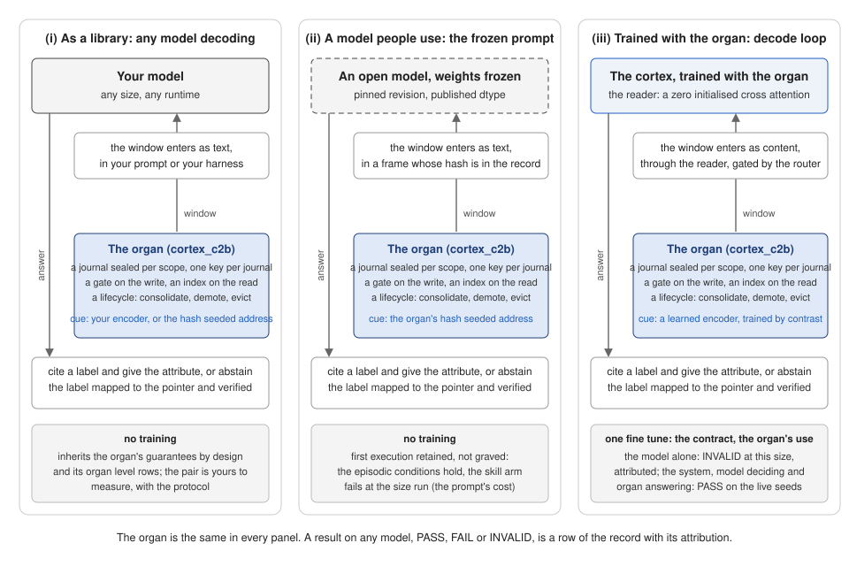

# quantum-cortex

**An open, from-scratch language model built to measure one capability nobody measures: *continuity* — a model that remembers your project and visibly changes its mind when the world changes.**

Independent member of the [Quantum Meridian](https://github.com/vaneeckhoutnicolas/quantum-meridian) ecosystem: the same cognitive concepts that Quantum Meridian runs *as orchestration around third-party models* (expert zones, associative memory, an oracle channel, typed decode contracts) live here **in the weights and the decode loop**. Apache 2.0, trained from scratch, a dependency in neither direction.

**The thesis, and what the record now says about it.** A language model is asked to be one system: to know, to recall and to judge, all from the same weights. This project separates them. A sealed journal outside the weights holds the episodes, with their address, their time and the evidence of their own retrieval; the model reads that journal in generation under a contract that obliges it to cite or to abstain. The question the record answers is not whether the model can memorise more, it is **what belongs in the weights and what belongs in an organ**. Same first five steps as any language model, at a much smaller scale; post training here is one fine tune that teaches a contract, not a stage that bakes behaviour into the weights, and that behaviour lives in an organ outside them, measured against frozen thresholds; two steps others leave out, provenance before data and measurement after every run (the figure: [`docs/figures/pipeline-vs-cortex.svg`](docs/figures/pipeline-vs-cortex.svg), whitepaper §1.5).

Three measured answers, each with a test that can fail:

- **The organ holds what the weights should not.** Cut the journal and the episodes vanish while the skills are untouched; that dissociation is the protocol, frozen before any result existed, and it passes on four seeds in a new process from the disk alone.
- **The model does not recompute what the organ already knows.** At 27M parameters it learns to retrieve the right episode and to read it, and never learns, from the bytes alone, to judge whether what it read answers the question. Six data recipes moved a prior without moving that judgment. The limit is stated with its size attached.
- **Give it the organ's own judgment as a number, and the decision moves.** A familiarity mark written into every line of the read window cut claims on entities the journal never held from 0.62 to 0.10, the first movement of that discrimination in nine runs. With the organ also vetoing a weakly marked citation and supplying that line's own value, the four frozen thresholds hold on two independent seeds. The record states it as **the model decides, the organ answers** — never *the model manages it*, because the exactness of the answer is the organ's by construction.

That last sentence is the point, and it is why this is not a memory feature bolted onto a language model. It is the two systems hypothesis made falsifiable at a size one researcher can afford: a cortex that does not rebuild what its hippocampus already holds. What such an organ could also carry — consequences that depend on context, the difference between *what happened* and *what would happen* — is a door this paper names and does not open; see `docs/IDEAS-REGISTER-2026-08-07.md`.

Built by one researcher with a language model as design, implementation and review partner, under an evidentiary discipline strict enough that **the absence of a result is itself a recorded result**. All eleven measurements of the model alone are INVALID and are published in the same table as the rest, with their attribution; what holds is the system, the model deciding and the organ answering, on two live seeds.

---

**Status board:** [`docs/STATUS-2026-09-13.md`](docs/STATUS-2026-09-13.md) — the sequence of steps, what each validated, what is tried next, in plain words, and what carries to a larger model.

## What exists today (verify each line)

| | Result | Evidence |
|---|---|---|
| **Baseline** | Byte-level GPT-2-style control, 25.9M params, **val_ppl 2.601** on 500M FineWeb-Edu tokens | [`metrics/runs.jsonl`](metrics/runs.jsonl) run `be1fa8139f59`, schema-validated in CI |
| **Continuity, first measurement** | The **Molaison dissociation (the H.M. protocol: named after Henry Molaison, the patient whose hippocampus was removed in 1953 and who formed no new episodic memory from that day while keeping every skill he had; the protocol asks the model the same question: with its journal cut, do the episodes vanish while the skills stay?) passes** against the persistent-memory organ: recall **1.000** with the journal, **0.125** without (chance floor), gap **0.875** vs required 0.50; the journal **never hallucinates** a fact it does not hold (negative control 0.000); skills journal-independent. Stable on 4 seeds. Since 2026-09-12 the same pass holds with the journal **sealed on disk and reopened from the disk alone** for session B (`persistent: true`, `claimable: 1`), gated on 4 seeds since 2026-09-14 (recall 1.000 on every seed, gaps 0.85 to 0.92, negative control 0.00 to 0.055 against the line 0.10). | [`metrics/mqar/hm-protocol-2026-09-08.json`](metrics/mqar/hm-protocol-2026-09-08.json) · persistent runs: [`hm-protocol-persistent-2026-09-12.json`](metrics/mqar/hm-protocol-persistent-2026-09-12.json) and `hm-protocol-persistent-2026-09-14-seed{1,2,3}.json` · spec frozen 2026-08-08: [`docs/benchmarks/hm-protocol.md`](docs/benchmarks/hm-protocol.md) · `tests/test_c2b_hm_protocol.py` |
| **The journal in the decode loop, eight measurements on the model (seven runs, the last on two seeds): INVALID eight times, attributable eight times, and step 4 closed at the maximal mechanism.** Fine tuned from N1, the model reads its journal as content through a zero init cross attention; the learned cue encoder generalises to entities never seen (86.5 to 98 % of the right episodes retrieved) and the reader reads (97 to 99.6 % of its attention on the retrieved bytes). Six data recipes (v1 to v6) left the decision to cite or abstain where a class prior puts it: the best grounding (v6, valid citations 61.5 %) still claims on 62 % of never planted entities. The seventh run added a matching head supervised on the exact question, "is the queried entity in the window": it learned a constant. A linear probe on its inputs is at chance on held out pairs, and citing the line the reader attends most does no better than generating the label. The limit is the reader's representation at this size: it reads the window, not the line, and carries at most a weak, seed dependent trace of the comparison (a second seed, trained on a laptop GPU, repeats the reading). Session B in a new process reproduces every number of the eight measurements. | [`docs/RESULTS.md`](docs/RESULTS.md) rows 21 to 29 · [`metrics/mqar/hm-lm-7e343011489f.json`](metrics/mqar/hm-lm-7e343011489f.json) · [`docs/adr/ADR-008-journal-in-the-decode-loop.md`](docs/adr/ADR-008-journal-in-the-decode-loop.md) |
| **Memory ablation (associative recall, MQAR)** | Two associative memories — modern-Hopfield and gated delta-rule — each beat the transformer control on the 12-tier curve (single seed); **no single memory dominates**: Hopfield owns easy/dense tiers, delta the hard/short ones, the control the long ones. Only 6/12 tiers are separable. | [`metrics/mqar/domain-map.md`](metrics/mqar/domain-map.md) · [`mqar-ablation-final-2026-09-07.json`](metrics/mqar/mqar-ablation-final-2026-09-07.json) |
| **The memory router (RES-18)** | A router over paths (control / Hopfield / delta / journal) on a **guaranteed non-regression floor**: a memory is used only where it beats the control. The oracle ceiling is **+21%** over the control, **+6%** over the best single memory. The *learned* router reaches that ceiling on a synthetic task and **not yet on real spans** (12 tiers is too few — recorded, not hidden). | [`cortex_c2/`](cortex_c2/) · [`router-ablation-real-spans-2026-09-07.json`](metrics/mqar/router-ablation-real-spans-2026-09-07.json) · ADR-006 D8–D9 |
| **External anchor** | A from-scratch ladder of pure recurrent models (GLA + selective gate + channel decay + local conv + delta rule, each from its paper), now at **eight seeds, 1500 steps, paired on seed with the control and the two hybrids** (128 units, the first real cut and resume). At three seeds and 1000 steps the hybrids reached 3-4x the best pure rung; at eight seeds and 1500 steps the comparator changes: **the local convolution rung (L3) takes off on five seeds of eight** (0.47 to 0.67 at 8 pairs) and the statement does not carry over. The hybrids trail L3 and do not beat the control. | [`metrics/mqar/ladder8-ckpt/`](metrics/mqar/ladder8-ckpt/) · [`PROVENANCE-ladder8.json`](metrics/mqar/ladder8-ckpt/PROVENANCE-ladder8.json) · [`docs/RESULTS.md`](docs/RESULTS.md) rows 18-20 |
| **What the gate refused, and the one line it let through** | At eight seeds the six declared tests: five held (hybrids vs the best pure rung: t −2.10 / −1.97; hybrids vs control: t 1.11 / 0.56; control vs the best pure rung: t −2.30) and one gated, structural and negative: **the delta rule pure trails the local convolution pure** (L4 vs L3, t −3.21, df 7), with its reserve written next to it (a bimodal comparator; a sign test does not pass). **No line in favour of a memory thesis.** The three seed run keeps its date (superseded); the five seed run stays withdrawn (its log was never retained). A selection envelope over the separately trained models (0.235) is a ceiling, held twice over: a maximum is significant against its own components by construction, and no router inside one model can compose separately trained models. | [`LATEST-ladder8.json`](metrics/mqar/ladder8-ckpt/LATEST-ladder8.json) · [`metrics/mqar/logs/`](metrics/mqar/logs/) · [`docs/WHITEPAPER.md`](docs/WHITEPAPER.md) §4.4b |

**Scope, stated plainly:** everything above is at 25M parameters and MQAR scale. The Molaison pass is a measurement of the *organ* (hash-seeded cue encoder, reference skill probe), not yet of the language model reading its journal in generation; its first artefact (2026-09-08) was produced within one process (`persistent: false`, not claimable, in the protocol's vocabulary since 2026-09-12); the second (2026-09-12, one seed) reopens a sealed journal from the disk alone (`persistent: true`), and the organ's survival across a real process restart is established by test (ADR-007 D8). No comparison has yet passed the statistical gate. These are the three open locks, and each has a scheduled key (below).

---

## Why this is worth your time — four contributions

1. **A law borrowed from black-hole thermodynamics that decides when a result may be claimed.** The author's parallel physics program ([mirror-bh-thermodynamics](https://github.com/vaneeckhoutnicolas/mirror-bh-thermodynamics)) proves that thermodynamic invariants which look volatile when only the visible horizons are counted become *exact* when the complete root set is counted — the apparent noise is the share of what was left out (R² = 1 under full accounting, verified to forty digits). Transposed here as **rule 6 of the admission gate — the completeness test**: before claiming, regress the result on the declared context; unexplained variance is treated as an *omitted factor*, not as noise, and blocks the claim until it is found or declared a limit. The law has already acted on this repository twice, in both directions: it exposed an ill-posed metric (the router's "93% of the oracle ceiling" was a ratio over a collapsing denominator — replaced by an absolute measure) and it **refused** to rescue a near-miss (the 5-seed delta result at t = 2.65: the per-seed variance regressed on context at R² 0.15–0.20 — genuine, not omitted, so no adjusted analysis was admissible). A method that corrects its author in both directions is the strongest evidence this repository offers that its numbers can be trusted. → [`docs/WHITEPAPER.md`](docs/WHITEPAPER.md) §2.7 and rule 6, [`metrics/mqar/completeness-test-router-2026-09-08.json`](metrics/mqar/completeness-test-router-2026-09-08.json), register RES-20.
2. **A continuity benchmark that exists before a model scores well on it.** The Molaison protocol (episodic persistence), the oracle-shift protocol (adaptive revision) and the reference-ratio protocol (non-regeneration) are specified, seeded, config-hashed and open. Whoever defines the measurement frames the question. → [`docs/benchmarks/`](docs/benchmarks/)
3. **A memory router that cannot degrade the model.** Control as the floor, routing regime that hardens as it consolidates, a circuit breaker that re-routes instead of killing — versioned behind a retro-compatible contract (v2 was added as one dispatch branch; v1 untouched). → [`cortex_c2/`](cortex_c2/), ADR-006
4. **A method you can audit.** 228 tests in CI, 216 in about two minutes without the training smoke tests; 8 architecture decision records and a 25-entry decision log, dated and never rewritten; a run ledger where unknowns are `null`; two retrogradations and one invalid run kept in the artefacts. The collaboration itself follows a design thinking discipline the author formalised in 2018 (understand before solving; diverge then converge; hold desirability, viability and feasibility together): the researcher supplies the upstream structure, the model supplies rapid divergence and execution, and the ledger arbitrates — a pattern that caught five over claims in one week and is reproducible by others. One consequence is recorded as the project's long horizon (whitepaper §5b): the organ this repository builds, a journal that survives the session boundary and a gate that judges by persistence, is the organ its own AI collaborator lacks; the model that co designed it does not persist between sessions, and the author's ledger reproduced by hand the capability the project measures. That is an ambition, not a result. The same evidentiary discipline was independently converged on by the author's physics program (theorem register, per-claim novelty pre-gates, dated follow-up notes, an archive kept for provenance) — suggesting it is a property of the method, not of either subject. → [`docs/WHITEPAPER.md`](docs/WHITEPAPER.md) §2, [`docs/adr/`](docs/adr/)

---

## Who this is for

The cortex is built for settings where continuity is the decisive property. Where it is not, use a frontier model. Five settings, each tied to what the triad must measure and to the organ that measures it:

- **A long running project companion.** A lawyer on a six month case: a decision taken in January (set an argument aside, on the strength of a ruling) is recalled in May in a fresh session, the ruling is cited rather than re summarised, the discarded argument stays discarded. *Persistence and non regeneration; the Molaison protocol measures exactly this; C2b.*
- **An assistant whose world changes.** A compliance officer: a directive enters into force on Tuesday, the oracle channel receives it, and by Wednesday the model's answers on reporting obligations have changed, visibly and datably, without retraining. *Revision; the oracle organ C3, not yet built.*
- **Private, local, encrypted memory.** A general practitioner keeping follow up notes on her own machine, one encrypted journal per patient, recall across consultations months apart, no record ever sent to an API. *Persistence under a trust boundary; needs scale and ternary weights.*
- **The local model of an agent.** A Quantum Meridian agent asks the cortex for everything that touches the project's history and a frontier model for new code; the cortex signals, through its decode contracts, when a question leaves its domain. *The non regression router, at the scale of models.*
- **The measurement, for other laboratories.** A team with a long memory model runs the open suite (Molaison, oracle shift, reference ratio) with its frozen thresholds on their own model and publishes a comparable number. *The product here is the benchmark, not the model.*

What the cortex is not: a general chatbot, a frontier code model, or a competitor on raw capability. The five settings above hold precisely because they rest on a capability those models do not have and do not measure.

**Where each setting stands (the landing of 2026-09-14; every cell has its artefact in `docs/RESULTS.md`):**

| Setting | Holds today | Holds with a mention | Postponed, said as such |
|---|---|---|---|
| The measurement, for other laboratories | The Molaison protocol, thresholds frozen 2026-08-08; the organ passes, persistent and claimable, on four seeds (row 13b); a 27M model measured six times, INVALID six times, attributed six times (rows 21 to 26); `notebooks/reproduce_molaison_cpu.ipynb` reproduces the organ's pass in minutes without a GPU | The model arm is measured, not passed | The oracle shift and reference ratio suites are not built |
| A long running project companion | The organ as a component: gated write path, sealed on disk journal, session B in a new process; `cortex_c2b/companion_demo.py` on a fictional matter followed from January to May, five planted questions cited with the right record, three never written questions abstained (`metrics/mqar/companion-demo-2026-09-14.json`) | Addressing is exact at the organ level (the entity is the address); paraphrase addressing is the model arm's job | The 27M model reading its own journal in generation: at its measured limit, closing test in progress |
| The local model of an agent | The encoder retrieves (0.98) and the reader reads (0.98) on the model; the decode contract exists | The decision and the citation are the measured limit of the data recipes; the closing test (a matching head, two decode policies) decides this week | Lands if a policy passes the four conditions; otherwise written as a limit at this size and postponed to scale |
| An assistant whose world changes | Nothing | | The oracle channel C3 is not built; the setting is not served |
| Private, local, encrypted memory | The journal sealed at rest, one scope per subject, survives a process restart (ADR-007) | Served by the organ only | The model that fits on a device (scale, ternary weights) is not built |
| The recurrent ladder and the hybrids | The eight seed ladder (rows 18 to 20) and the Σ (row 27): L3 takes off, mostly a matter of training length; no memory advantage of the hybrids at this size | A finding and a negative structural line, not a product | The recurrent base arms at sixteen seeds (rows 30 to 35): both arms beat the pure rung at 95 %, with a trunk that never takes off (the attention pre empts it); the trunk's contribution is the reliability of the take off; stage B is the founder's decision |
| v9, the familiarity mark (row 36): the organ's own similarity written in every read window line; the oracle passes, and for the first time the 27M model's discrimination moves (claims on absent entities 0.62 to 0.10, strict recall 0.385 to 0.75); INVALID by the invalid citations and by the negative control at the line; the external model arm's first execution (Qwen3-1.7B) retained: the episodic contract holds, the skill arm fails |
| v9 on a second seed and the organ side policies read live (rows 37, 38): the model alone stays INVALID; with the organ vetoing a citation whose line is weakly marked and supplying that line's own value, the four frozen conditions hold on the seed that did not conceive the policy, a system result on one live seed; the retrieval probe says the remaining misses are the index's buckets, not the cue |
| The third seed (row 39): the system holds the four frozen conditions on **two live seeds** that did not conceive the policy, strict recall 0.845 and 0.890 with invalid citations and claims on never planted entities at zero on both; the model alone stays INVALID on all three |

## Reproduce it (no GPU needed to verify)

```bash
git clone https://github.com/vaneeckhoutnicolas/quantum-cortex && cd quantum-cortex
pip install torch --index-url https://download.pytorch.org/whl/cpu
pip install -e . && pip install pytest
pytest tests/ -m "not slow"        # 216 tests: ledger, data-mix invariants, C2 layers, router, journal, lifecycle, restart, storage policy, journal in the decode loop, recurrent base hybrid, Molaison
python -m cortex_c2b.hm_protocol    # the Molaison dissociation, end to end, in seconds (persistent: false, in memory)
python -m cortex_c2b.hm_protocol --persistent   # the same, sealed on disk, session B reopened from the disk alone
python train.py --config configs/smoke_journal_cpu.json   # the journal in the decode loop, the whole loop on CPU in a minute (ADR-008); a mechanics smoke, not a result
python -m cortex_c2b.external_arm --frame                 # the external model arm's frozen prompt, hash 7fda43aced410d65; the runbook is docs/benchmarks/external-arm.md
python -m cortex_eval.resumable_rb --quick --reference-from <a ladder subset dir>   # the recurrent base hybrid family, four arms, in seconds (Rev38); mechanics, not a result
python -m cortex_eval.domain_map    # the per-tier domain map from the committed artefacts
```

GPU runs (the MQAR ablation, the confirmation run) reproduce from the notebooks in [`notebooks/`](notebooks/) on a free Kaggle T4; every run writes its record to the ledger. Full setup: [`docs/GETTING-STARTED.md`](docs/GETTING-STARTED.md).

---

## Use it with your own model

The organ is a component; the 27M cortex is one of its users. Three ways to compose it with a model, each stated in whitepaper §3.6 with what it inherits from the record and what it has to measure for itself:

1. **As a library, any model decoding, no training.** `Journal` (sealed per scope, one key per journal), `WritePath` (the gate: what the journal already predicts is refused), `JournalPath` (the index: a read is never a scan), `lifecycle`. Your model receives the retrieved lines as a window and answers under the contract: cite a label and give the attribute, or abstain. The cue is any unit vector of 64 floats: the protocol's hash seeded address below, or your own encoder. Worked example: `python -m cortex_c2b.companion_demo`.
2. **A model people use, through the frozen prompt, no training.** `python -m cortex_c2b.external_arm` runs the Molaison dissociation unchanged around an open model (Qwen3 pinned at 1.7, 4 and 8 billion parameters; any other runtime is a wrapper with three calls: `complete`, `nll`, `describe`). First execution retained, not graved: the episodic conditions hold, the skill arm fails (+18.7 % perplexity with the window in front of ordinary text). Runbook: [`docs/benchmarks/external-arm.md`](docs/benchmarks/external-arm.md).
3. **A model trained with the organ in its decode loop.** `cortex_c2b.lm_bridge` and `cortex_c2b.organ_use`, the way the cortex itself was measured; written for this repository's byte level transformer, not carried to another architecture in this edition.



The first way, in a dozen lines. Session A, today (the key comes from the environment, one per journal, never from a file):

<!-- compose: session A -->
```python
import os
from cortex_c2b import Journal, POLICY_STOP
from cortex_c2b.write_path import WritePath
from cortex_c2b.read_path import JournalPath
from cortex_c2b.hm_protocol import address_cue

key = bytes.fromhex(os.environ["QUANTUM_CORTEX_JOURNAL_KEY"])     # one key per journal, one journal per scope, never in a file
journal = Journal("runs/my-scope/journal.jsonl", key=key, policy=POLICY_STOP)
write, read = WritePath(journal, admission_threshold=0.15, seed=0), JournalPath(journal)
report = write.write(address_cue("decision|argument:originality"),
                     b"12 Jan: the originality argument is set aside on the strength of ruling 2024/AR/512",
                     "decision", now=0.0)
if report.admitted:                                                # the gate refuses what the journal already predicts
    read.on_write(report.entry)
print("written" if report.admitted else f"refused: {report.reason}", report.entry.pointer[:12] if report.entry else "")
```

Session B, months later, in a new process that knows nothing of session A but the disk:

<!-- compose: session B -->
```python
import os
from cortex_c2b import Journal, POLICY_STOP
from cortex_c2b.read_path import JournalPath
from cortex_c2b.hm_protocol import address_cue

key = bytes.fromhex(os.environ["QUANTUM_CORTEX_JOURNAL_KEY"])
journal = Journal("runs/my-scope/journal.jsonl", key=key, policy=POLICY_STOP)   # reopened from the disk alone
read = JournalPath(journal)
for address in ("decision|argument:originality", "decision|argument:database-right"):
    hits = read.retrieve(address_cue(address), k=4)                # never a scan; (entry, payload, score) per hit
    if hits and hits[0][2] >= 0.5:                                 # the declared line on the journal's own score
        entry, payload, score = hits[0]
        print("cite", entry.pointer[:12], payload.decode())        # the window your model answers from, under the contract
    else:
        print("abstain: no record for", address)
```

Expected: the first address is cited with its pointer and its record, the second is abstained on (no record was written); running session A again is refused as redundant; the files under `runs/my-scope/` are sealed (no plaintext at rest). `tests/test_compose_snippet.py` runs these two blocks as they stand, session B in a new process, and asserts all four. The line at 0.5 is declared for this cue convention; with your own encoder, set it on addresses never written before use, as the companion demonstration does. Before believing a pair of a model and the organ, run the protocol on it (`docs/benchmarks/hm-protocol.md`, thresholds frozen since 2026-09-12); a result on any model, PASS, FAIL or INVALID, is a row we publish next to ours with its attribution.

---

## Where to read next

- **The paper, as it is being written:** [`docs/WHITEPAPER.md`](docs/WHITEPAPER.md) — thesis, method, architecture, results as a domain map, open questions; claims enter only through a seven-rule admission gate.
- **Every decision, dated:** [`docs/adr/`](docs/adr/) (ADR-001…008) · [`docs/IDEAS-REGISTER-2026-08-07.md`](docs/IDEAS-REGISTER-2026-08-07.md) (37 ideas, each with an implementation status) · the ecosystem-level log D1 to D25 in the [hub](https://github.com/vaneeckhoutnicolas/quantum-meridian/blob/main/docs/reference/quantum-cortex.md).
- **What happens next, and its gates:** [`docs/SEQUENCE.md`](docs/SEQUENCE.md).
- **The approach, before the numbers:** [`docs/JOURNEY.md`](docs/JOURNEY.md) — a long haul, what this edition means and does not, what comes next, and what it implies if it holds.
- **AI agents:** read [`CLAUDE.md`](CLAUDE.md) first — the working rules are non-negotiable.

## What comes next (gated, in order)

1. ~~**The recurrent ladder at eight seeds**~~ **Done (2026-09-12): read cold, graved as rows 18 to 20.** It contradicted its hypothesis and produced the run's real finding, L3's bimodal take off. The Σ of the convergence ran (2026-09-13, row 27): two of the three floor seeds take off by 3000 steps, the third is undecided, and no seed learns 16 pairs at 3000 either: the bimodality was mostly speed, and a floor at 1500 steps is not a verdict. Stage A of the recurrent base hybrid ran (2026-09-16, rows 30 and 31): at 3000 steps seven seeds of eight take off on L3 pure; the two decisive arms reach 0.97 with a trunk that never takes off: the attention pre empts the recurrent base, the risk named before the code; stage B (the consolidation arms) is the declared answer, not yet run. The reference that tests why the arms reach 0.97 (row 32, the control plus the trunk's convolution) is bimodal: the convolution suffices for the level where it engages, four seeds of eight at exactly 1.000; the trunk's contribution is the reliability of the take off. At sixteen seeds (rows 33 to 35) both arms beat the pure rung at 95 % (the claim of Rev38 in its letter, with a dead trunk) and beat the convolved control; the convolved control's floor seeds do not move at 12 000 steps.
2. ~~**The language-model arm of Molaison**~~ **Closed on the model alone (rows 21 to 29, 36, 37, 39: INVALID, attributed) and held by the system on two live seeds (rows 37 and 39): the model decides, the organ answers.** The organ's security measured (row 40). The whitepaper v1 is the landing edition of that work.
3. **v1.1, in the order the record names them:** the index's buckets, a wider negative control, the write side separation of near duplicates, the detectors as code, stage B of the recurrent base arms, the reader with a local convolution, the external arm's agreement then larger open models, the reconstruction test on the organ's layer of numbers (`docs/JOURNEY.md`).
4. **C3, the oracle channel** → the second component of the triad (adaptive revision); then **a 100M+ run** (EuroHPC Development Access; the author's company is eligible) → the reader's selectivity as a function of size, the door that decides the model arm's future.

Contributions welcome on any of the four — see [`CONTRIBUTING.md`](CONTRIBUTING.md). The most valuable first contribution is a **replication**: run `pytest`, run the Molaison protocol, and open an issue with what you saw.

---

## License and attribution

**Lost between RES, Rev, ADR, rows and D numbers?** `docs/NAVIGATION.md` is the key: what each label means, the path an idea takes from the register to a measured row, and which documents are current versus historical.

**Where things are.** `docs/WHITEPAPER.md` is the paper. `docs/RESULTS.md` is the record: one row per measurement, with its artefacts, the test that recomputes it, and its reserve. `docs/FALSIFY.md` is the twenty minute way to attack it. `docs/adr/` holds the decisions, declared before the runs they govern; `docs/IDEAS-REGISTER-2026-08-07.md` holds every idea with its dated revision. `metrics/` holds the ledger, the artefacts and the retained logs. `cortex_c2b/` is the memory organ, `train.py` the training entry point, `tests/` the suite that recomputes every published aggregate. `docs/working/` holds the collaboration's own notes: method, not evidence.

**Trying to break it?** `docs/FALSIFY.md` is the twenty minute version: the frozen thresholds and when they were fixed, the readings declared before each run, the negative rows, the command that recomputes every published aggregate from its artefacts, and what would falsify the central claim.

Apache License 2.0, unmodified. You may use, modify, fork and redistribute this work freely, with no warranty and no liability on the author's side (Sections 7 and 8 of the License; [`DISCLAIMER.md`](DISCLAIMER.md)), on the conditions the License itself imposes, one of which is attribution: **the attribution notices of the `NOTICE` file must travel with any copy or derivative work** (Sections 4(c) and 4(d)), and with them the statement that quantum-cortex was originally created by Nicolas Van Eeckhout; a redistribution that drops them is outside the License, and the author's moral rights of authorship under Belgian law hold independently of it. To cite the work, use [`CITATION.cff`](CITATION.cff) (GitHub renders it as "Cite this repository"). The continuity benchmarks published here carry the same requirement. The pretraining slice is drawn from FineWeb-Edu (ODC-By 1.0), attributed in `NOTICE` and in the whitepaper's references. The documentation, the whitepaper and the figures are under CC BY 4.0 ([`LICENSE-DOCS.md`](LICENSE-DOCS.md)); the code stays Apache 2.0.

---

*Author: Nicolas Van Eeckhout (Win2Win SRL, Brussels) · [ORCID 0000-0002-5256-3185](https://orcid.org/0000-0002-5256-3185) · License Apache-2.0 · Companion physics program: [mirror-bh-thermodynamics](https://github.com/vaneeckhoutnicolas/mirror-bh-thermodynamics).*
