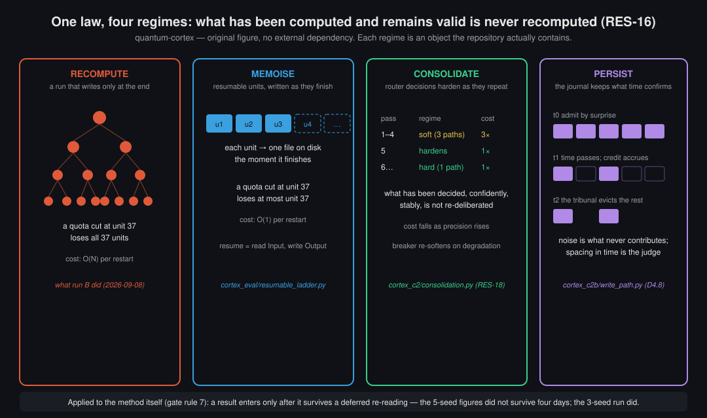
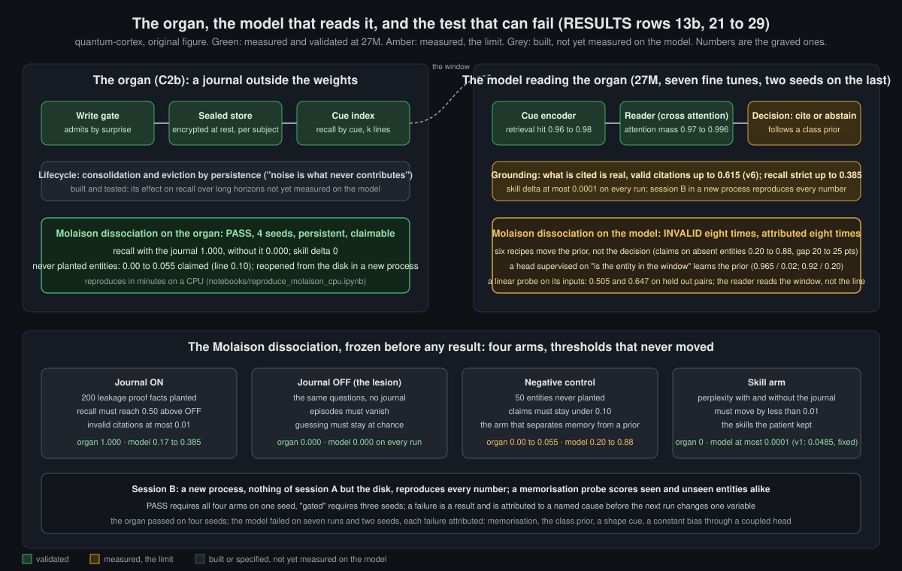

# WHITEPAPER — "Continuity as a first-class capability" — living skeleton

**Status:** deliverable specified 2026-09-07 (D19). This file is the paper's **living skeleton**: it
grows by consolidation (RES-19) — a section is filled only with claims that have passed the
**admission gate** below. Everything else lives in *Open questions*, explicitly labelled. The
skeleton is versioned like everything else: dated additions, prior text kept.

**Why a paper, and why now:** D19 says the method is as much the contribution as the model — the
demonstration that an individual with an AI alter-ego can build something significant *by rigour,
not force*. A paper is how that demonstration reaches the world. Specifying it early keeps every
chantier honest about what it must produce to be *publishable*, not just *interesting*.

## The admission gate (a claim enters a results section only if ALL hold)

1. **Statistical** — measured on ≥ 3 seeds, the gap significant at 95% (paired test, `cortex_eval/multiseed.py`). A single seed is an anecdote, not a claim.
2. **Anchored** — situated against the external references (`cortex_eval/external_baseline.py`, the recurrent ladder) at equal size, tiers, steps.
3. **Real, not toy** — demonstrated on the real task (real MQAR spans / real language-model runs), not only a synthetic surrogate. (Level 1b showed a 93% toy result collapsing to 25% on real spans — this rule exists because of that.)
4. **Reproducible** — a committed artefact (`metrics/`), a config hash, a run_id; the code that produced it is in the repo.
5. **Honestly bounded** — reserves stated (seeds, scale, single capability); losses and retrogradations published alongside.
6. **Complete** (the completeness test) — the result is regressed on the declared context (data hash, regime, scale, held-out composition); unexplained inter-seed or inter-holdout variance is treated as the signature of an *omitted factor*, not noise, and blocks the claim until the factor is found or declared as a limit. (Transposed from the author's parallel physics program [Van Eeckhout, 2026], where thermodynamic "volatility" vanished exactly under complete accounting; first applied to our own router result, where it exposed an ill-posed ratio metric and sharpened a retrogradation.)

7. **Persistent** (the deferred re-reading) — a result enters only after it has survived a re-reading separated in time from the run that produced it: its source re-opened as a file, its numbers re-derived, its claim still standing. What is judged at the moment it appears is judged on its surprise; what is judged after an interval is judged on its persistence — the same rule the journal applies to its own entries (§3, the noise tribunal: noise is what never contributes; spacing in time is the judge). First application: figures reported at five seeds did not survive a four-day interval (their source could not be re-opened) and were withdrawn; the three-seed run did survive and stands.

A finding that fails any rule is an **open question**, not a result — and open questions are a legitimate, valued part of the paper (they are what a solo founder can *pose* to the field).

## Skeleton

### 0. Abstract

We ask whether a language model can be given a memory that survives the boundary of a session, and whether that property can be specified, measured and improved reproducibly at a scale one researcher can afford. We specify *continuity* as a triad (episodic persistence, adaptive revision, non regeneration), freeze a protocol for its first component before any result exists, the Molaison dissociation, named after the patient whose hippocampus was removed in 1953 and who kept his skills while forming no new episodic memory, and build one candidate organ: a journal sealed at rest, written through a gate that admits by surprise, read through a cue index, persistent across process restarts. The organ passes the protocol on four seeds, in a new process, from the disk alone, and never returns an attribute for an entity it does not hold. We then fine tune a 27M parameter byte level model to read that organ in generation under a cite or abstain contract, and measure it seven times, on two seeds for the last run, against the same frozen thresholds: it retrieves the right episode (96 to 98 %), reads it (97 to 99 % of its attention on the retrieved bytes), grounds what it claims (valid citations up to 61.5 %), and never learns to decide whether what it read answers the question. Six data recipes move a class prior without moving that decision; a head supervised on the exact question learns the prior; a linear probe on its inputs finds at most a weak, seed dependent trace of the comparison. The limit is attributed to the reader's representation at this size and left as an open question for a larger run. On a ladder of recurrent memories at eight seeds, no hybrid beats the best pure rung, and a bimodal take off turns out to be mostly a matter of training length. The paper's third contribution is the method: an evidentiary discipline (frozen thresholds, one variable per run, a ledger, retained logs, attributed failures kept, a construction error caught by re reading the code, a disagreement between two AI instances settled by the source) under which a single researcher and an AI collaborator produced these results. Everything is reproducible from the repository; the organ's pass reproduces in minutes without a GPU.

### 1. Thesis — continuity as a capability

**1.0 The aim, this step, and the next.** Stated plainly, because a paper that hides its ambition cannot be judged on it. The aim is a language model built in Europe, from scratch, on an architecture that takes its organs from what neuroscience knows about memory rather than from what scales fastest: a sealed journal that plays the hippocampus, a consolidation rhythm, a router that arbitrates memories on a floor it cannot fall below, decode contracts that say when the model does not know. The bet is that continuity, not raw capability, is where a small, sovereign, auditable model can occupy a position the cloud laboratories do not, and that the way to earn that position is to measure continuity with tests that can fail. This paper is one step of that program, the one a single researcher can take on shared and commodity compute: the organ exists and passes its test; the measurement exists and is open; the model at 27M parameters reads the organ and does not yet decide from it, and we say exactly where the limit sits. The next step is a larger run in the European high performance computing environment (EuroHPC access is the declared route, §5d), where the questions this paper leaves open, the reader's selectivity to the entity, the size at which it emerges, the hybrids at a longer horizon, become experiments rather than reserves. Nothing in the aim is claimed as a result; the results are in §4, and they are smaller than the aim, as they should be at the first step.

**1.1 Scope.** This paper does not compete on general language-modeling capability. At the scale accessible to a single researcher (tens to hundreds of millions of parameters, commodity or shared-HPC compute), that contest is settled by resources rather than ideas. We instead isolate one capability that current evaluation practice does not measure, and ask whether it can be specified, measured, and improved reproducibly at small scale.

**1.2 The capability.** We call it *continuity*: the property of a model that (i) retains episodic content across the boundary of a session or context window, (ii) revises its predictions when an exogenous signal indicates that the world has changed, and (iii) does not regenerate content it already holds, referencing it instead. We deliberately treat continuity as a **triad** rather than a scalar. The three components are dissociable — a system may persist without revising, or revise without persisting — and a blended score would hide exactly the trade-offs of interest. Each component receives its own protocol:

- *Episodic persistence* — the Molaison dissociation protocol (the H.M. protocol), named after Henry Molaison, the patient whose hippocampus was removed in 1953 and who formed no new episodic memory from that day while keeping every skill he had [Scoville & Milner, 1957]; the protocol asks the model the same question: with its journal cut, do the episodes vanish while the skills stay? Synthetic facts introduced in a session are probed after the session boundary, with a matched control that must show no persistence; leakage controls use synthetic entities absent from any pretraining corpus.
- *Adaptive revision* — an oracle-shift protocol: a first-class input channel carries exogenous events, and the model's predictive distribution is measured before and after a controlled shift.
- *Non-regeneration* — a reference-ratio protocol: the fraction of output tokens that cite existing spans rather than re-emit them.

The protocols are specified before any model exists that scores well on them, and are published as an open, versioned suite. We consider defining the measurement to be a contribution independent of the model.

**1.3 Evaluation stance.** All results are read as a Pareto frontier over declared axes — the three continuity components plus two efficiency denominators (capability per parameter, capability per bit) — never as a single scalar. A perplexity tolerance of 2% relative to the control is a *guard* that a candidate must clear to be considered, not an axis on which it can win. No composite score is computed. Optimizations across components are not assumed additive; joint effects are recorded next to isolated effects.

**1.4 Positioning: who continuity is for.** The intended contribution is threefold: a specification of continuity as a measurable capability; an architecture in which memory components are arbitrated on a guaranteed non regression floor (§3); and a method by which a single researcher, working with an AI system as a design and engineering collaborator, can produce reproducible results under a strict evidentiary discipline (§2). We make no claim to state of the art general capability. The model is intended for settings in which continuity is the decisive property, and we name five such settings, each tied to the component of the triad it requires and to the organ that measures it. Where continuity is not decisive, frontier models are the appropriate tool.

- *The long running project companion.* A practitioner who works for months on one matter: a lawyer on an intellectual property case decides in January to set aside an argument on the strength of a ruling; in a fresh session in May, asked for a hearing strategy, the model recalls that decision and its ground, cites the ruling already analysed rather than summarising it again, and does not resurface the discarded argument. Component: episodic persistence and non regeneration. Organ: the persistent tier C2b (§3) and typed span references. This is the setting the Molaison protocol measures, and the one the Quantum Meridian orchestration layer already serves around third party models.
- *The assistant whose world changes.* A compliance officer following European banking regulation: a directive enters into force on a Tuesday; the oracle channel receives the event, and from Wednesday the model's answers on reporting obligations change, visibly and datably, without retraining. A model frozen at its training cutoff would answer as the world stood then. Component: adaptive revision. Organ: the oracle channel C3 (not yet built).
- *Private, local, encrypted memory.* A general practitioner keeping patient follow up notes on her own machine, sending no record to any API: the journal is encrypted per patient, the model never sees another patient's record, and recall works across consultations three months apart. A model with genuine associative memory that fits on a local device occupies a position that cloud economy laboratories cannot take. Component: episodic persistence under a trust boundary. Requires scale and ternary weights (§5).
- *The local model of an agent.* A Quantum Meridian agent managing a team's infrastructure: for everything that touches the project's history (why a service was migrated, what was decided after an incident) it queries the cortex, which carries that memory in its journal; for writing new code it calls a frontier model; the cortex signals, through its decode contracts, when a question leaves its domain. Component: persistence plus contracted decoding. This is the non regression router of §3 applied at the scale of models rather than of memories.
- *The measurement itself, for other laboratories.* A research group that has published a long memory model and wishes to show that it retains episodes rather than reconstructs them downloads the open suite (the Molaison protocol, oracle shift, the reference ratio), runs it with its frozen thresholds on their own model, and publishes a result comparable to ours. Here the product is not the model but the measurement; whoever defines the benchmark frames the question.

**1.4b What the results serve today (landing, 2026-09-14).** The five settings are not served alike, and this paper says which. *The measurement for other laboratories* is served in full: the Molaison protocol with its thresholds frozen before any result, the organ's pass on four seeds with the journal sealed on disk and reopened from the disk alone (§4.5, RESULTS row 13b), a 27M model measured eight times against the same thresholds, seven runs with the last on two seeds, and attributed eight times (§4.7, rows 21 to 29), and a notebook that reproduces the organ's pass in minutes on a CPU; the oracle shift and reference ratio suites remain to be built. *The long running project companion* is served by the organ as a component, decoded by a contract or by a larger model rather than by the cortex itself: on a fictional matter followed from January to May, a fresh process months later cites the right record for every planted question and abstains on every question that was never written (`cortex_c2b/companion_demo.py`, its retained transcript in `metrics/mqar/`), with the organ level convention that the entity is the address; the learned addressing of paraphrases is the model arm's job and stands where §4.7 leaves it. *The local model of an agent* depends on that model arm: the encoder and the reader measure well, the decision and the citation are the measured limit of the data recipes, and a closing test declared before its measurement (ADR-008, 2026-09-14) decides this week whether the setting lands at this size or is written as a limit and carried to scale. *The assistant whose world changes* is not served: the oracle channel is not built. *Private, local, encrypted memory* is served by the organ's sealing and scoping only; the model that fits on a device is not built. The recurrent ladder and its hybrids (§4.4b) are a finding about training length and a negative structural line, not a product, and the recurrent base arms are a research thread staged after the closing test. Nothing in this paragraph is a promise; each sentence has a row in `docs/RESULTS.md`.

**1.5 Relation to other approaches, and what is different here.** Memory for language models is an active field, and this paper is a small contribution to it; the point of this section is to say precisely where it differs, so that a reader can decide whether the difference matters to them. Four families of work are relevant.

- *Long context windows.* The dominant answer to "remember what was said" is to keep it in the context. That is memory as a buffer: nothing survives the end of the window, nothing is written or judged, and the question "does the model hold this or reconstruct it" cannot be asked because everything is visibly present. Our organ sits outside the context and outside the weights, and the protocol asks exactly that question, with the journal cut as the counterfactual.
- *Retrieval augmented generation and agent memory systems* (vector stores; frameworks such as MemGPT [Packer et al., 2023] and its successors). Memory is external, retrieved by embedding similarity, and the model is trusted to use what it retrieves. These systems are usually evaluated on downstream task accuracy. Three things differ here. The write path is gated by surprise and judged by persistence, so not everything seen is stored. The store is sealed at rest, per subject, and reopened by the protocol from the disk alone. And the evaluation has a negative control and a skill arm: it measures claims on entities that were never stored, and skills with and without the store, and it is these two arms that failed the model at 27M while the retrieval succeeded. A retrieval score alone would have called our model arm a success at 96 to 98 %.
- *Memory inside the weights, written at test time* (fast weight and neural memory modules, from modern Hopfield and delta rule layers [Ramsauer et al., 2020; Schlag et al., 2021; Yang et al., 2024] to Titans [Behrouz et al., 2025], which also writes on a surprise signal). This is the closest family in spirit, and our recurrent ladder uses two of its members. The difference is where the memory lives and how it is judged: a memory in the weights is not sealable, not auditable, not separable from the skills by a lesion; ours is, and the dissociation is the test. On the ladder itself our contribution is a negative result at eight seeds with a reserve, not a new module.
- *Long memory benchmarks.* Needle in a haystack style tests measure retrieval from a long context; ours measures retention across a process boundary, with a negative control, a skill arm and a cite or abstain contract, under thresholds frozen before any result, and it publishes the failures with their attribution. Whoever runs it on their own model gets a verdict that can be INVALID, and a reason.

What we think is added, stated without ranking: a memory organ that is separable, sealed and persistent, proved so by a lesion test with a negative control; an evaluation that can fail and did, seven times, each time with a named cause; and a record of the method under which a single researcher and an AI collaborator produced it. What is not added: a better language model, a new memory layer, or a result at a size where general capability claims could be made.

**1.6 Where this work sits: the Quantum Meridian ecosystem.** quantum-cortex is not a standalone model project. It is the memory organ and the measurement of a wider program, Quantum Meridian, an open core orchestration layer for agents (a fork of an open source coding agent, running in the editor and behind a local proxy) whose design constraints are the ones this paper's settings of §1.4 come from: agents that keep state across sessions, that run on the user's machine when the data must not leave it, that call a frontier model only for what a local model cannot do, and that say when a question leaves their domain. Meridian already serves the long running companion setting around third party models with the discipline described here (dated decisions, retained records, a memory that is a file rather than a prompt); what it lacks is a model of its own that reads such a memory natively, and a test that proves the memory is a memory. quantum-cortex supplies the second today and works towards the first. The division of labour is deliberate: the orchestration layer addresses the local, private and multi agent dimensions, the cortex addresses continuity as a measurable capability, and the hub repository (`quantum-meridian`) holds the decision log that binds the two (D1 to D24). Nothing about Meridian is claimed in this paper; it is named so that the reader knows which system the organ is built for, and why "local" and "sealed per subject" are requirements rather than preferences.

### 2. Method — an evidentiary discipline for single-researcher work

The project was carried out by one researcher in continuous collaboration with a large language model acting as a design, implementation and review partner. We describe the discipline that governed this collaboration, because we consider it to be the primary reason the results in §4 can be trusted, and because it is reproducible independently of the architecture.

**2.1 Measure-first.** No architectural component enters the model on the strength of an argument. Every component is introduced behind a configuration flag that defaults to off, so that the control configuration is bit-identical to the baseline (a test asserts this). A component advances only if an ablation, at equal parameters, data, seed and schedule, extends the Pareto frontier of §1.3. Components that do not clear the bar are recorded as losses.

**2.2 The ledger.** A training run that has not been committed to an append-only ledger does not exist. Each record follows a versioned JSON schema (`run-v1`) validated in continuous integration, and carries a configuration hash and a content hash of the data mix (`mix_hash`). Two runs are comparable only if their `mix_hash` coincide; "at equal data" is thereby a machine-checkable property rather than a claim.

**2.3 Data as a first-class object.** The data mix is a directed acyclic graph of typed operators (sources, transforms, combinators), evaluated lazily and hashed per node. Identical sources are folded by content signature before sampling, so that a mix of a source with itself is a multiset-equivalent of the source — a property enforced by an invariant test. Decontamination is a first-class operator: evaluation *n*-grams may not appear in training data, and a quantified contamination report is archived per mix.

**2.4 Tests from the first day.** Structural invariants were written before, not after, the components they protect. Five defects were caught by these tests prior to any ablation: two in the sampling semantics of the data mixer, one in which a global weight initializer silently overwrote the zero-initialization that guarantees a memory layer starts as a no-op, one ordering error in a routing-hysteresis counter, and one numerical divergence of a recurrent memory under unnormalized keys. Each would have invalidated an ablation without producing a visible failure. We report them because the discipline that catches such defects is part of the method, not an incident.

**2.5 The circuit breaker.** Training runs are subject to an aggressive early-abort rule with a bounded refine-and-retry loop: NaN or Inf losses abort immediately; divergence beyond a declared multiple of the control's loss over a window aborts; each abort may trigger at most two pre-declared refinements (tighter gradient clipping, then a reduced learning rate) before the configuration is retired. Thresholds are fixed before the run and never adjusted post hoc. Every abort is a ledger record. In the ablation of §4 the rule fired twelve times on a divergent configuration, cleanly, before the defect of §2.4 was corrected.

**2.6 Admission of claims.** A finding enters a results section of this paper only if it is (i) measured on at least three seeds with the relevant gap significant at the 95% level under a paired test, (ii) situated against external references at equal size, (iii) demonstrated on the real task rather than a synthetic surrogate, (iv) reproducible from a committed artefact, and (v) stated with its reserves. Findings that fail any criterion are reported as open questions. This rule was adopted after a result obtained on a synthetic routing task (a learned router capturing ~93% of an oracle ceiling) was found to shrink to ~25% on the real task with the same code; we regard the retrogradation as a result of the method rather than a failure of the model.

**2.7 The same discipline, twice.** The author maintains a parallel research program in classical gravitation (mirror-constrained black-hole thermodynamics [Van Eeckhout, 2026], six preprints in preparation) with no subject-matter relation to language models. That program independently converged on the same apparatus: a theorem register, per-claim novelty pre-gates against the literature, a pre-submission checklist, dated follow-up notes, an archive kept for provenance, forty-digit cross-validation against published closed forms, and the explicit recording of falsified hypotheses. That two unrelated fields, worked by one researcher with a language model as collaborator, produced the same evidentiary discipline suggests the discipline is a property of the method rather than of either subject. One result crossed over: the physics program's *complete-ledger* observation — that apparent volatility of an invariant is the signature of an omitted variable and vanishes under complete accounting — became rule 6 of the admission gate above, and its first application to our own router result replaced an ill-posed ratio metric with an absolute one.

**2.8 Decisions and errors.** Every design decision is a dated record; amendments are appended, never substituted, so that the record of what was believed and when is preserved. Nineteen such decisions and twenty dated revisions of the idea register underlie this paper. We note that the collaboration with the language model was itself subject to this discipline: proposals from either party were treated as hypotheses to be tested, not as conclusions.

**2.9 The collaboration as design thinking.** The working method between the author and the language model was not improvised for this project. It follows a design thinking discipline the author formalised in 2018 for his consultancy (Cogarius, *Design Thinking Snapshot*, June 2018): understand before defining the problem, define the problem before designing the solution; observe, contextualise, structure, empower, co create; alternate divergence and convergence in loops (co understand, then co design); and hold desirability, viability and feasibility together rather than optimising one. Each of these maps onto a rule of this repository. The idea register precedes any code, and the continuity protocols were frozen before a model existed that could pass them (understand before solving). The landscape reading of the recurrent family, then the ladder that situates our components inside it, is observation followed by contextualisation. The decision records and the domain map are structure. The admission gate and the circuit breaker are the empowering tools. The memory router of §3 emerged from three dictated messages, refined in dialogue: co creation. And the Pareto reading of §1.3 is the three way tension of desirability, viability and feasibility applied to a model.

The two participants are wired differently, and the collaboration was designed to make that difference productive rather than to erase it. The author supplies the upstream structure: which variables exist, which invariants must hold before code is written, what a result must consolidate to count. The language model supplies rapid divergence and execution: variants, drafts, implementations, the literature at hand, and a first pass at every document. The structure frames the generation; the generation feeds the structure; the ledger arbitrates. When the model over claimed, the author's structural checks caught it (five retrogradations in one week, §2.6); when the author's intuition needed a form, the model gave it one in minutes. Neither side alone would have produced a repository in which the absence of a result is itself a recorded result. We report this not as a claim about either participant but as a reproducible pattern: a researcher with a strong upstream discipline and a generative partner with a broad reach, bound by a shared evidentiary gate, can do research that is faster than the researcher alone and more honest than the model alone.

One consequence deserves its own statement, because it changes what the researcher is for. When production becomes nearly free, the bottleneck moves. The author is, by his own account, fast; that speed was an absolute advantage among people, where producing was the scarce step. With a generative partner it became relative: the partner produces faster than anyone can read. The scarce step is no longer producing but *judging* what is true, and that is where the author's speed now goes. In this project the five over claims of §2.6 were caught by the researcher's judgement, not by the model's output; the admission gate is that judgement made explicit and repeatable. The pattern generalises: in a collaboration where generation is cheap, the human's value concentrates in the gate, and a method that does not make the gate explicit will drift toward whatever the generator finds plausible.

**2.10 The cost of the evidence, as facts.** Because the claim of §1.4 is that this discipline is reproducible by a single researcher, its cost is itself a result and is stated from the record. Ten training runs in the ledger, 24.9 GPU hours in total, 1.42 billion tokens, on a free Kaggle T4 for nine of them and a laptop GPU for the tenth; every model measurement of §4.7 took about two hours of T4 and its cold reading, session B and probes took minutes on a CPU. Two hundred and seventeen tests, two hundred and five of them in about two minutes; eight architecture decision records; seventy dated revisions of the ideas register; twenty four decisions in the hub's log; six weeks from the register's first entry (2026-08-07) to this edition. No cloud budget was spent on any result in this paper. The relay of checkpoints to a private dataset (Rev54) and the resume of finished units were what made the longer runs survive a shared platform's interruptions; both are in the repository. The point is not frugality for its own sake: it is that every number here can be re derived by someone with the same means, which is most people.

### 3. Architecture — a memory router on a non-regression floor

**3.1 Base model.** The base model is a byte-level decoder-only transformer of the GPT-2 lineage, trained from scratch, with a reserved block of token identifiers for exogenous (oracle) events. We keep the base deliberately conventional so that every departure from it is attributable to a single ablated component. The design draws on a mapping from brain systems to model components — associative memory, a thalamic-style gating channel, basal-ganglia-style action vetoing, a neuromodulatory bus — recorded as a validated feature map; we use the mapping as a source of hypotheses, not as a claim of biological fidelity.

**3.2 Associative memory (C2).** Two memory layers are implemented as an additional residual sub-block in each transformer block, each zero-initialized at the output projection so that the model begins as the control and learns the memory: a modern-Hopfield layer (a learned bank of key/value patterns read by softmax attention — a static, content-addressable memory) [Ramsauer et al., 2020], and a gated delta-rule layer (a per-head recurrent state updated by an error-correcting rank-one write with a per-channel forget gate, keys L2-normalized) [Schlag et al., 2021; Yang et al., 2024]. The two belong to the same fast-weight family and differ in whether the memory is static or written online.

**3.3 The router.** The central architectural proposal is that C2 should not be one memory, nor a fixed choice between memories, but a **router** over paths — the control (no memory), the Hopfield layer, the delta layer — subject to three constraints:

1. *A guaranteed floor.* The control path is always available. A memory path is selected on a span only where its predicted score exceeds the control's; if no memory path does, the control is used. Consequently the router cannot degrade the model relative to the control: at worst it equals it. Falling to the control on a span is recorded as a result, not a failure.
2. *Routing regime follows consolidation.* Where the router has learned, over repeated passes, which path wins for a span type — confidently and stably — it routes *hard* (one path, selected before computation, at minimal cost). Where it has not, it routes *soft* (paths computed and mixed), which is more expensive but generates the signal from which hardening is later decided. The system migrates from soft to hard as it learns; average cost falls as routing precision rises. Hardening is deliberately conservative: an uncertain decision is never hardened.
3. *Fallback with hysteresis.* When a selected path degrades or diverges, the breaker of §2.5 re-routes to the best remaining path above the control, or to the control, and re-softens the decision. A declared cooldown prevents oscillation between paths.

The router is versioned behind a stable interface: a v1 oracle (which reads the true per-path scores and therefore computes the ceiling any learned router may reach) and a v2 learned gate (which predicts per-path scores from the span context alone). State is serialized with a version tag and dispatched by version, so later versions extend the interface without breaking earlier ones.

**3.4 One mechanism at three scales.** We observe that the same consolidation law — *what has been computed and remains valid is not recomputed; what changes recomposes only its delta* — governs the memory hierarchy inside the model, the soft-to-hard migration of the router, and the accumulation of tested components and dated decisions in the project itself. We do not claim this as a theorem; we record it as the organizing principle that made the three levels mutually consistent, and as the reason efficiency appears in §4 as a consequence rather than a trade-off. Figure 1 (`docs/figures/consolidation-regimes.svg`, original) shows the law in the four regimes the repository actually contains: recompute (the anti pattern — a run that writes only at the end), memoise (resumable units written as they finish), consolidate (router decisions hardening as they repeat), and persist (the journal keeping what time confirms).

### 4. Results — read as a domain map, not a ranking

*(Only gate-passing claims enter as results; each with artefact, seeds, CI. Cells are filled from `metrics/mqar/domain-map.json` as evidence accrues.)*

**4.1 Baseline.** Control `be1fa8139f59`: byte-level GPT-2-style, 25.9M parameters, val_ppl 2.601 on 500M FineWeb-Edu byte-tokens. Reproducible; anchored; a baseline, not a comparison (rule 1 does not apply).

**4.2 The reading rule (why a map).** The first ablation (12 tiers, one seed) ranked the memories by whole-curve AUC: Hopfield +14%, delta +2% over the control. The confirmation run, restricted to the hard/short tiers where the paths actually separate, ranked them the other way: delta first, Hopfield at the control. Under rule 6 this is not a contradiction; it is the omitted factor Σ — *which tiers are held*. The honest object is therefore a **domain map**: for each tier, the winning path and its margin, with the evidence basis. Of the 12 tiers, only 6 are separable (margin ≥ 0.01); on the other 6 no path can be distinguished, and a whole-curve ranking silently averages over them.

**4.3 The domain map** *(single-seed basis unless marked; multi-seed rows carry a 95% paired test).*

| regime | separable tiers | winner | evidence |
|:--|:--|:--|:--|
| easy / dense recall (kv 4, seq 128–512) | 3 | **Hopfield** (margins 0.016–0.051) | 12-tier, 1 seed — *pending multi-seed* |
| hard / short (kv 8–16, seq 128) | 1 + confirmation tiers | **delta** (0.033 at kv 8/128; leads on both completed confirmation seeds) | 12-tier 1 seed + confirmation *(3 seeds, in progress)* |
| long sequences (kv 8–16, seq 512) | 1 | **control** — memory hurts (0.188 vs 0.150) | 12-tier, 1 seed — *pending multi-seed* |
| saturated (kv 32, seq 256–512) | 0 | none — noise-level (all ≈ 0.01) | not a result |

**4.4 What passes the gate — the confirmation run (3 seeds, 1000 steps, tiers kv 16 and 8 at seq 128; verified by its retained log and its committed Kaggle artefact).**

| comparison | mean gap | paired t (df = 2) | t_crit 95% | verdict |
|:--|--:|--:|--:|:--|
| delta vs control | +0.0107 (+13%) | 1.76 | 4.30 | does not pass |
| Hopfield vs control | −0.0031 (−4%) | −0.54 | 4.30 | does not pass |
| Hopfield-hybrid vs best pure recurrent (L4) | **+0.048** | **3.78** | 4.30 | does not pass |
| delta-hybrid vs best pure recurrent (L4) | **+0.062** | **4.09** | 4.30 | does not pass |

Nothing enters as a claim. The two rows that matter are the last two: against the best rung of the recurrent ladder (the gated delta rule, L4), the hybrids reach three to four times its accuracy with t statistics of 3.78 and 4.09, held only because three seeds set the critical value at 4.30. This is a design-limited hold, not a variance-limited one. The next run is the ladder at eight seeds (t_crit 2.37 at df 7); whether the effect clears that bar is for the run to decide. One candidate finding is withdrawn by this run: "the delta rule regresses when pure" (L4 − L3 = +0.008, t = 0.90) was a single-seed artefact of an earlier mini-run.

*A second run at five seeds was reported during preparation of this paper and is withdrawn: its numbers were read from a log that was not retained as a file and could not be located afterwards. Under §2.6 an unverifiable source yields no result; the withdrawn figures are kept in the repository's artefact history so the error is visible.*

**4.4b The ladder at eight seeds (1500 steps, tiers kv 16 and 8 at seq 128; 5 pure rungs, the control and the two hybrids on the same seeds; 128 resumable units, the run cut by its budget at 126 and resumed once; verified by its two retained logs and the runner's aggregate; RESULTS rows 18 to 20).**

| comparison (declared before the run) | mean gap | paired t (df = 7) | t_crit 95% | verdict |
|:--|--:|--:|--:|:--|
| Hopfield-hybrid vs best pure rung (L3) | −0.100 | −2.10 | 2.365 | held |
| delta-hybrid vs best pure rung (L3) | −0.101 | −1.97 | 2.365 | held |
| control vs best pure rung (L3) | −0.106 | −2.30 | 2.365 | held |
| Hopfield vs control | +0.0065 | 1.11 | 2.365 | held |
| delta vs control | +0.0053 | 0.56 | 2.365 | held |
| L4 (delta rule pure) vs L3 (local conv pure) | **−0.153** | **−3.21** | 2.365 | **passes, with a reserve** |

The comparator changed. At three seeds and 1000 steps the best pure rung was L4 and the hybrids reached three to four times it (§4.4); at eight seeds and 1500 steps the best pure rung is **L3**, the local convolution, at 0.192 with a confidence interval of 0.077 to 0.306 — because L3 **takes off on five seeds of eight** at 8 pairs (0.47, 0.53, 0.64, 0.67, 0.54) and stays at the floor on three (0.05, 0.06, 0.04), while at 16 pairs it stays at the floor on all eight (0.009, against 0.050 for the control). The transformer control and the transformer based hybrids never reach it and never collapse (standard deviations 0.013 to 0.018 against 0.137). Nothing enters in favour of a memory thesis: the hybrids trail L3 and do not beat the control. The statement of §4.4 is superseded, not withdrawn: it was true at its regime and does not carry over. One line passes the declared test, structural and negative — the delta rule pure trails the local convolution pure — and carries its reserve under §2.6 rule 5: the comparator is bimodal, six differences of eight are negative (five large, one at −0.0005), a sign test does not pass (p 0.29). The finding of the run is the bimodality itself (rule 6: the omitted factor is the convergence, a seed takes off or not); whether the three seeds are *not yet* or *never* is the next cheap measurement (register Rev38). *That measurement ran (RESULTS row 27): L3 pure at 3000 steps on the three seeds at the floor. Two of them take off between 1500 and 3000 and land at 0.79 and 0.88, above every take off measured at 1500; the third stays at the floor, undecidable at this step count; at 16 pairs none of the three learns the task at 3000, as none of the eight had at 1500. The bimodality of the ladder was therefore mostly a distribution of speeds, not two basins, and a floor at 1500 steps is not a verdict: the recurrent base arms, if they are compared, are compared at a step count where the pure trunk has had time to take off, against references measured at that same count.* *Stage A of those arms ran (RESULTS rows 30 and 31, 2026-09-16, read cold 2026-09-17). At 3000 steps the pure rung takes off on seven seeds of eight (0.79 to 0.90; one seed stays at 0.096) and the transformer control stays at 0.132. The two decisive arms of the recurrent base hybrid, the attention open from step zero and the attention behind a critical period, reach 0.97 on every seed with the trunk alone at 0.01 and no trunk taking off: the attention path pre empts the recurrent base, the risk named before any code. The critical period's criterion, a plateau of the trunk's loss, fired at steps 217 to 234 on every seed, at the plateau that precedes the take off on this task, so the period protected the trunk for about 220 steps. Neither arm beats the pure rung at 95 % (t 2.12 and 2.13 against 2.365), every difference being positive: the hold is the comparator's bimodality, a reserve. Both arms beat the transformer control (gated), which is a fact about a single attention path over a local convolution trunk. The reference that tests why (RESULTS row 32, declared before its run: the control plus the trunk's convolution, one variable) is bimodal: the convolution suffices for the level where it engages (four seeds of eight at exactly 1.000, above the arms) and does nothing where it does not; what the recurrent trunk adds to the arms is the reliability of the take off (8 of 8 against 4 of 8), not the level. At sixteen seeds (RESULTS rows 33 to 35, 2026-09-17, eight new seeds declared before the run for every path so that the comparisons stay paired): both arms beat the pure rung at 95 % (+0.162, t 3.36 and 3.40 at df 15, every one of the sixteen differences positive), the claim of the recurrent base amendment met in its letter and not in its intent, since the trunk is dead on all thirty two arm units; the arms beat the convolved control (+0.37, gated; sixteen of sixteen taking off against nine of sixteen), which makes the trunk's contribution, the reliability of the take off, a paired result; and the convolved control's floor seeds stay at the floor at 6000 and 12 000 steps. The arms that carry a consolidation term and a retraction, the declared answer to the pre emption, are not yet run.*

*What is known, and what this measures (literature pass of 2026-09-17).* A short causal convolution in front of an attention or state space mixer is not a finding of this work: H3 built a shift matrix into its state space layer precisely so that a model could recall and compare tokens across a sequence (Fu et al., 2023); Mamba keeps a causal convolution inside every block (Gu and Dao, 2023), which is where the ladder's rung L3 comes from; Primer found a depthwise convolution after the query, key and value projections among the two modifications that most robustly speed up transformer training (So et al., 2021); and the Zoology and Based line, which built the associative recall benchmark used here, combines a short convolution with attention as its standard solution to recall at small scale (Arora et al., 2024a, 2024b). Mechanistically, an induction circuit needs a previous token composition before the head that copies (Olsson et al., 2022), and a kernel of three supplies it without a second layer having to learn it. What this section adds is only what those papers do not report in this form: on a paired protocol at eight and sixteen seeds, the effect is all or nothing per seed, the convolution suffices for the level where it engages and does nothing where it does not, and the recurrent trunk's contribution to the hybrid arms is the reliability of that take off (rows 31, 32). The phase change of Olsson et al. is the closest description of the per seed structure; whether it is the same phenomenon is not tested here.

**4.5 Continuity, first measurement — the Molaison dissociation.** The episodic-persistence component of the triad (§1.2) has its first number. Against the C2b organ (§3; store, hippocampal write path, journal as router path), the Molaison protocol — 200 leakage-proof synthetic facts planted through the gated write path, probed in a fresh context with the journal on and off, a 50-fact negative control, thresholds frozen on 2026-08-08 — returns `hm_dissociation_pass = 1`, stable across four seeds: recall 1.000 with the journal, 0.125 without (the chance floor; threshold 0.175), a gap of 0.875 against the required 0.50, a journal negative-control rate of 0.000 (the store never returns an attribute for an entity it does not hold), and a skill delta of 0. *Cut the journal: episodic recall collapses; skills hold.* The founding prediction — weights carry the semantic and procedural, the journal carries the episodic — is thereby a measurement rather than a design premise. **Scope (rule 5):** this is a measurement of the organ, with a hash-seeded cue encoder and a reference skill probe; it establishes that the journal stores, retrieves and refuses to confabulate, and that the two stores are separable. The persistent variant of the same measurement, the journal sealed on disk and session B reopening it from the disk alone in a new object, passes on four seeds as well (recall 1.000 on each, gaps 0.85 to 0.92, negative control 0.00 to 0.055 against the line 0.10; RESULTS row 13b, gated 2026-09-14). The language-model arm — real skill suites, a learned encoder, the model reading the journal in generation — is the v1 requirement (§5). **Method note (rule 5):** the first run was invalid on the negative control (0.12); the journal was clean (0.000) and the fault lay in the reference floor simulator and in a specification that read guessing as hallucination; the simulator was corrected and the specification amended, dated before the rerun, with δ, ε_S and the floor untouched (`docs/benchmarks/hm-protocol.md`, amendment of 2026-09-08).

**4.6 The result that the map itself constitutes.** No single memory dominates: Hopfield, delta and the control each own a regime. This is the empirical content behind the architecture of §3: a router on a control floor is not an elegance, it is what a per-domain result *requires*. The upper envelope of the map (best path per tier) exceeds the best single path by +6% and the control by +21% on the 12-tier basis — the ceiling a router may reach (§5 records how far the learned router currently is from it). *At eight seeds (§4.4b) the same envelope over the separately trained models reaches 0.235 against 0.192 for the best single model: a ceiling, held twice over — a maximum is significant against its own components by construction, and no router inside one model composes separately trained models. What could realise part of it inside one model is the recurrent base hybrid of register Rev38, a design, not a result.*

**4.7 Continuity on the model, first measurement — INVALID, and attributable (2026-09-12).** The journal of §4.5 was wired into the language model itself: a learned cue encoder (a projection of the residual stream, trained by contrast), a zero initialised cross attention over the retrieved bytes in one block, on the router's gate, and a contract for episodic answers — cite the local label of a retrieved episode and give the attribute, or abstain — whose training targets are computed from what the journal actually returned, never from the ground truth alone (ADR-008). N1 was fine tuned for 40M tokens with half the steps on that curriculum; the frozen protocol then ran on the model, and session B ran again in a new process from the checkpoint and the sealed journal alone. The verdict is INVALID under the amended spec: 88 % of claims on never planted entities (the invalidation line is 10 %), 86.5 % invalid citations, strict recall 0.040, skill delta 4.85 %. The attribution triple, reported next to the verdict by design, says where it broke: the encoder generalises (93.5 % of the right episodes retrieved for entities never seen in training), the reader reads (98.5 % of its attention on the retrieved bytes), the answer does not ground (0.53 exact given a valid citation, and valid citations are 7.5 %). Two causes are named from the run's own log, as hypotheses with their evidence: the training pool was one fixed set of 200 facts for 2441 steps and the curriculum loss fell to 0.09, so the model could memorise entity to attribute and skip the window; and the reader was never trained with a window on ordinary text, while the skill arm measures the reader active on ordinary text. The second run declares one lever per cause — a fresh, decontaminated pool at every replant; a retrieved window on the language modelling steps — and moves no threshold. Two facts survive the INVALID: session B in a new process reproduced every number (the full process restart holds on the model, not only on the organ), and the model's perplexity without the window ended at 2.587 against N1's 2.601. A failure that says which component failed is the result the method was built to produce. *The second run (v2, `5f0a6d3ff4e8`, same day) applied the two levers and nothing else: the skill delta fell from 4.85 % to 0.01 % (the reader learned to ignore an irrelevant window), invalid citations fell from 86.5 % to 27 %, claims on never planted entities from 88 % to 36 %, and a probe on the entities seen in training scored exactly like the unseen ones, so the memorisation shortcut is closed. The failure moved rather than vanished: the model now abstains on 70 % of the facts whose episode is in its window — the "silence first" cold start named before the run — with the curriculum loss still falling at the end. The third run changes one thing, the length.* *Its result (v3, `ce008745375a`, 120M tokens): the model grounds — valid citations 3 % → 51 %, strict recall 2.5 % → 31 %, false abstention 70 % → 25 %, the skill delta at 0.0000, no memorisation (a probe on seen entities scores like the unseen ones) — and claims on 50 % of the never planted entities, so the verdict stays INVALID on the negative control alone. Three runs, three faces of one failure, each named by the attribution triple: claiming without reading, reading and abstaining, reading and citing without discriminating an absent entity. The fourth run moves one variable aimed at that last face, the share of negatives in the curriculum.* *Its result (v4, `6f10e8cbfebf`): claims on never planted entities 50 % → 20 %, and valid citations 51 % → 12.5 %: the lever paid its sub measure with the other. Four runs make the mechanism legible — the rate of claims on planted facts against never planted ones is 30 / 36 %, 75 / 50 %, 22.5 / 20 % over v2, v3, v4: the decision to cite or abstain follows the share of negatives seen in training, a class prior, far more than the window's content. A prior is easier to learn than a comparison, and the curriculum allowed it. The fifth run removes the prior's value the way the fresh pool removed memorisation's: negatives become minimal pairs, the same planted fact with its episode withheld from the window.* *Its result (v5, `db028e6a4262`): INVALID, and the lever did not test what it declared. Claims on never planted entities 50 % → 58 %, valid citations 51 % → 43 %, the discrimination between planted and absent unchanged (78 / 58 % against 75 / 50 %), the encoder at its best (96.5 %). The cold reading of the code found why before any number was interpreted: the pair as built removed the episode from the read and left the window one line shorter, while every protocol window keeps its lines; a count of lines is cheaper than a comparison, predicts the training target nine times in ten, and says cite on the negative control. The run's numbers are compatible with that shortcut and do not measure it; a probe on the retained checkpoint can. The construction error is recorded as such: the minimal pair hypothesis is untested, not refuted, and the sixth run keeps the pair's shape by construction. Two readers of the same log reached opposite conclusions on the same day, one that the comparison was the model's measured limit, the other that the lever was confounded; the source settled it, which is the gate's rule 6 applied to the reading itself.* *The sixth run (v6, `81cb13a684aa`) kept the pair's shape and separated two things the earlier runs had mixed. The clean pair is the best data recipe of the six for grounding: valid citations 61.5 %, strict recall 38.5 %, invalid citations 22.5 %, false abstention 16 %, the encoder at 98 %, the perplexity without the window below N1's. It does not create the discrimination: claims on never planted entities 62 %, and the gap between claims on planted and on absent entities stays at 22 points, where separate negatives (v3) and short pairs (v5) had left it at 25 and 20. Three recipes that move the overall claim rate and not the gap measure a limit rather than a trend: at this size, under this contract, the model reads its journal and grounds what it claims, and does not learn from data whether what it read answers the question. The two gate conditions that require that comparison (invalid citations at 1 %, claims on absent entities under 10 %) were never approached in six runs. The reading that one instance had reached from v5 too early is earned on v6, on a clean pair, and the next lever is declared by amendment before it is built: a mechanism that supervises the comparison directly, not another recipe.* *The mechanism ran (v7, `7e343011489f`): a matching head on the reader's output, supervised on the exact label, coupled to the decision token. It learned a constant, present on 96.5 % of planted facts and on 98 % of never planted entities, and the coupling handed the model one more shortcut, a fixed bias, which it took: the contract loss tripled and the grounding fell. Two decode policies declared before the measurement, the head deciding and the head deciding with the label read off the reader's attention, could not rescue a constant head, and the second showed that the line the reader attends most is the right line four times in ten. A linear probe fitted after the fact on the head's two inputs is at chance on held out minimal pairs. Three measures, one reading: at this size the reader reads the window and not the line, its representation at the decision position does not carry the comparison, and nothing downstream can create what is not there. Step 4 closes on that limit, measured at the maximal mechanism and attributed to the reader. A second seed of the seventh run, trained on a laptop GPU, repeats it: the head learns the class prior again, the decision follows it, the grounding pays for the coupling, and the same linear probe finds a weak trace of the comparison in the reader's vectors (0.647 on held out pairs) where the first seed found none, so the representation carries at most a weak, seed dependent trace of it. The question it leaves is not a recipe and not a head: a reader whose attention is selective to the queried entity, or a size at which that selectivity emerges, for a larger run.*

**4.7b The nine measurements on the model, in one table.** Every number below is read from the artefact `metrics/mqar/hm-lm-<run_id>.json` of the run; the thresholds in the headers are the frozen ones. The reading is the same on every line: the two columns of the organ side (encoder, reader) are near their ceiling from the first run, the skill column never moves after the first run's leak was closed, and the four columns of the decision move together as a seesaw whose two ends are a class prior, never towards the lines.

| run | the one variable | claims on absent entities (line 0.10) | false abstention | valid citations | invalid citations (line 0.01) | strict recall ON (line 0.50) | encoder | reader | skill delta (line 0.01) | attributed to |
|:--|:--|--:|--:|--:|--:|--:|--:|--:|--:|:--|
| v1 | the baseline recipe | 0.88 | 0.060 | 0.075 | 0.865 | 0.040 | 0.935 | 0.985 | 0.0485 | memorisation of a fixed pool; a skill leak |
| v2 | a fresh pool at every replant, a window on the language modelling steps | 0.36 | 0.700 | 0.030 | 0.270 | 0.025 | 0.925 | 0.984 | 0.0001 | silence: the shortcut closed, the model abstains |
| v3 | three times the tokens | 0.50 | 0.250 | 0.510 | 0.240 | 0.310 | 0.900 | 0.984 | 0.0000 | grounding learned; the decision guesses |
| v4 | half the curriculum negative | 0.20 | 0.775 | 0.125 | 0.100 | 0.055 | 0.865 | 0.996 | 0.0001 | the class prior moved, not the discrimination |
| v5 | minimal pairs (the pair one line short) | 0.58 | 0.220 | 0.430 | 0.350 | 0.220 | 0.965 | 0.987 | 0.0000 | a shape cue (construction error, kept) |
| v6 | the pair with its shape kept | 0.62 | 0.160 | 0.615 | 0.225 | 0.385 | 0.980 | 0.979 | 0.0000 | the measured limit of the data recipes |
| v7 | v6 plus a matching head, coupled | 0.66 | 0.295 | 0.335 | 0.370 | 0.170 | 0.965 | 0.974 | 0.0001 | the head learns the prior; the coupling costs the grounding |
| v7, seed 2 | the same, another seed, a laptop GPU | 0.46 | 0.405 | 0.390 | 0.205 | 0.225 | 0.950 | 0.963 | 0.0000 | the same limit on a second seed |
| v9 | v6 plus the familiarity mark: the organ's own similarity in every window line (RES-23) | **0.10** | 0.105 | **0.755** | 0.140 | **0.750** | 0.935 | 0.996 | 0.0000 | the oracle passes, the model reads the mark in part; INVALID by the invalid citations and by the negative control at the line |

Three facts a reader can check on the table alone, for the first eight runs. The gap between the share of planted entities claimed (one minus false abstention) and the share of absent entities claimed never exceeds 25 points on any of them (v3: 25; v6: 22; v7: 4; v7 seed 2: 13), where a decision that read the window would put it near 90. The run with the best grounding among them (v6) is also among the three that claim the most on absent entities (0.62, after v1 and v7): grounding and discrimination were never bought together. And no lever moved the encoder or the reader by more than a few points: the organ side of the model was never the problem.

*Added 2026-09-18 (v9, RESULTS row 36).* The ninth run breaks the first two facts and keeps the third. One variable on v6: every line of the read window carries the organ's own similarity between the query's cue and that line's episode cue, `A(0.97):`, in training and at evaluation (RES-23, the familiarity mark; the design's own thesis applied, the organ knows what it holds and the cortex should not recompute it). The gap between planted claimed and absent claimed goes from 22 points to 80 (0.895 against 0.10); the grounding rises at the same time (valid citations 0.755, exactness given a valid citation 0.99, strict recall 0.75). A rule with no model, declared before the run as the ceiling of the signal, passes the protocol's gate conditions on these same reads (strict recall 0.935, claims on never planted entities 0.04, a threshold read from the training family only), so the signal suffices under the learned encoder; the model reads it in part, abstaining too much (0.105) and citing wrongly too often (0.14 against 1 %), and claims on five never planted entities of fifty, exactly the line the threshold draws below. The verdict is INVALID and the limit of step 4 is restated: not the reader's representation alone; given the organ's evidence as a number, the 27M model moves the decision it could not move from bytes, and what remains is its imperfect use of that number, on one seed. Read per line the same day (the answers kept, session B re read on a CPU with the rates identical): 25 of the 28 invalid citations cite the own line, the highest marked one, and answer a wrong value of the right kind, 17 of them a year answered with another of the generator's eight years, so the decision was right and the copy of the value was wrong; 12 of the 21 abstentions had no own line in the window, the encoder's misses; and the 5 claims on never planted entities rest on marks under 0.43, while the two never planted entities whose nearest line carried a mark above 0.62 were refused. The residual is the copy of a value from the right line, the encoder's misses, and a small timidity; none of them is the decision. Two organ side decode policies were then declared (ADR-008, 2026-09-18) and replayed post hoc on these same answers, which is not a result: the organ's veto on low marked citations alone brings the claims on absent entities to zero and leaves the wrong values; the veto plus the cited line's own value read by the organ from its statement holds the four gate conditions on this seed (strict recall 0.875, invalid citations 0.000, claims on absent entities 0.00, skill delta 0.000), with the model deciding which line and whether to cite and the organ answering. That reading does not depend on the veto's threshold, which can move from 0.40 to 0.95 without changing any of the four numbers, because on this seed the marks leave a gap between the highest never planted line the model ever cited (0.43) and the lowest own line (0.957). Written as a product, this run's strict recall is retrieval 0.935 × decision given retrieval 0.936 × copy given decision 0.857 = 0.750: three factors, the encoder, the decision, the answer, and the attribution of every run in the table is a statement about which factor moved. Whether that system passes is measured on a second seed, with its readings written before it runs; until then the paper's model arm stands at row 36, INVALID, attributed line by line.

*Figure 2 (`docs/figures/organ-and-protocol.svg`, original). Left, the organ: a write gate that admits by surprise, a store sealed at rest, a cue index, a lifecycle; its Molaison pass on four seeds. Right, the model that reads it at 27M: the cue encoder and the reader work, the decision follows a class prior; its eight INVALID verdicts, each attributed. Below, the four arms of the protocol with their frozen thresholds and where the organ and the model landed on each; session B and the reading rule.*

**4.8 What was measured, and what it validated or invalidated (the ideas, one by one).** The program rests on a small number of ideas. Each was turned into a measurement with a threshold declared before the run; this table is the paper in one place, with the row of `docs/RESULTS.md` that holds the artefact.

| Idea | Measurement | Verdict at this scale | Rows |
|:--|:--|:--|:--|
| Memory as an organ outside the weights, sealed, gated by surprise, persistent across restarts | The Molaison dissociation on the organ: 200 leakage proof facts planted through the gate, recall with the journal on and off, a 50 fact negative control, session B in a new process from the disk alone | **Validated**: pass on four seeds, recall 1.000, negative control 0.00 to 0.055 against a line of 0.10, persistent and claimable | 13, 13b |
| A dissociation test can distinguish "retains" from "has a prior" | The same protocol run on seven model fine tunes with its thresholds frozen | **Validated as a test**: it failed all seven, and each failure was attributed to a named shortcut | 21 to 29 |
| A small model can learn to read its organ in generation from data alone (cite or abstain) | Six data recipes, one variable each, against the frozen thresholds | **Invalidated at 27M**: the encoder and reader work (0.96 to 0.98), the decision follows a class prior in every recipe (planted versus absent gap 20 to 25 points, never near the lines) | 21 to 26 |
| A head supervised on the exact question can supply the missing decision | A matching head on the reader's output, coupled to the decision token; two decode policies; a post hoc linear probe; two seeds | **Invalidated at 27M, attributed**: the head learns the class prior on both seeds; the probe finds at most a weak, seed dependent trace of the comparison (0.505 and 0.647 on held out pairs); the coupling itself is a shortcut | 28, 29 |
| Memory components should be arbitrated by a router on a control floor | The domain map (12 tiers), the confirmation run (3 seeds), the ladder (8 seeds); the oracle router's ceiling | **Validated as a ceiling, unrealised as a mechanism**: no single memory dominates, the envelope beats every single path; the learned router reaches 93 % of the ceiling on a synthetic task and about 25 % on real spans | 4.3, 4.4, 4.4b, 4.6 |
| Hybrids of recurrent memories beat the best pure recurrent rung | The ladder at eight seeds, paired on seed | **Invalidated at this size**: no hybrid beats L3 or the control; a structural negative line with a bimodal reserve | 18 to 20 |
| The bimodal take off of the pure rung is a matter of basins | The Σ of the convergence: the three floor seeds at twice the steps | **Mostly invalidated**: two of three take off by 3000 steps; the bimodality is mostly a distribution of speeds; one seed undecided; the hard tier unlearned by all | 27 |
| One model can carry both regimes: the recurrent rung as the base, the attention added on a floor, protected by a critical period (register Rev38) | The bare arm and the critical period arm at 3000 steps, eight then sixteen seeds, paired against the pure rung, the control and the convolved control at 3000 | **Met in its letter, not in its intent, at sixteen seeds**: both arms beat the pure rung at 95 % and the convolved control, but with a trunk that never takes off (full 0.97, trunk alone 0.01 on all thirty two units); the attention pre empts; the critical period fired at the first plateau of the loss, before the take off; the consolidation arms are not yet run | 30 to 35 |
| One consolidation law at three scales (memory, router, project) | Not a measurement; the organising principle of the runners, the router and the ledger | **Not claimed**: recorded as the principle that kept three levels consistent (§3.4) | — |
| The method itself: a single researcher and an AI collaborator can produce results that survive scrutiny | Every claim above, plus the errors on the record: a construction error caught by re reading the code (row 25), two AI instances in disagreement settled by the source, a data provenance gap resolved on the content | **Validated by the record**: seven attributed failures, thresholds never moved, every number with its artefact | 2, 25, 28, Rev44 to Rev54 |

### 5. Open questions (valued, explicitly not results)
- **The learned router on real spans** — 93% of the oracle ceiling on a synthetic task, ~25% on real MQAR spans (12 tiers, under-sampled). Needs thousands of real spans (router wired into the LM). [Rev20]
- ~~Does the delta-rule pay only when hybridised?~~ **Withdrawn (2026-09-09) at three seeds, and back at eight (2026-09-12):** the single seed mini run suggested L4 regresses when pure; at three seeds L4 − L3 = +0.008 (t 0.90), a seed artefact; at eight seeds and 1500 steps L4 − L3 = −0.153 (t −3.21), the declared test passes with a bimodal reserve (§4.4b). The three seed statement "hybrids reach 3-4x the best pure recurrent" is superseded: the comparator changed. The open question is now **why L3 takes off on five seeds of eight, and whether one model can carry both regimes** (register Rev38: the Σ of the convergence, then the recurrent base hybrid in four declared arms).
- **The continuity triad — two of three components still unmeasured.** Episodic persistence has its measurement on the organ (§4.5, four seeds) and on the model (§4.7, eight measurements, the limit attributed to the reader's representation at 27M). Adaptive revision (oracle-shift) needs C3, not yet built; non-regeneration (reference ratio) needs the typed span-reference decode of RES-8, not yet built.
- **Scale** — everything is 25 to 27M / MQAR-scale; the first door of §5d (the reader's selectivity as a function of size, 150M to 1B, EuroHPC) is required before any capability claim generalises, and it is the measurement that decides the model arm's future.

### 5b. Ambition: the organ this project builds is the one its collaborator lacks

*(Recorded 2026-09-12 as an ambition, not a result; nothing in this section is claimed.)*

The collaboration described in §2.9 has a structural asymmetry that the project only named at its end. The language model that co designed this repository does not persist between sessions: each conversation begins without the previous one, and what carried the work across sessions was the author's ledger, dated decisions, a resume file, a hand written handover prompt. The author reproduced, by hand and by discipline, exactly the capability the repository is built to measure: episodic persistence across a boundary, revision when the world changes, reference instead of regeneration. The continuity triad of §1.2 is, read this way, a specification of what the collaborator is missing.

That reading turns the project's purpose inside out. quantum-cortex was framed as a model that remembers *the user's* project. The organ it builds, a journal that survives the session boundary, a write gate that admits by surprise and judges by persistence, a router that reads the journal only where it beats the control, a dissociation protocol that proves the two stores are separable, is the organ a system like its own collaborator would need in order to remember *anything*. Whether such an organ, at the scale this project can reach, is sufficient for a generative model to carry a working relationship across sessions is an open question and is stated as one. What the project can say is narrower and, we think, more useful: it has posed that question in a refutable form (the Molaison protocol, the oracle shift, the reference ratio), built one candidate organ, and measured its first component against that organ. The conversation that produced this repository was compacted, summarised and partly lost as it went; the repository it produced is a prototype of what would have kept it. The problem and its candidate answer came out of the same exchange.

We record this as the project's long horizon: not a model that remembers a user, but a measured account of what memory across a boundary requires, for any system, including the one that helped write this.

### 5c. The brain analogy: what maps and works, what maps and does not, what is not yet tested

The design took its organs from a mapping of brain systems to model components (ADR-003). The mapping was a source of hypotheses, not a claim of fidelity, and this section says, organ by organ, what the measurements did to each hypothesis.

| Brain system | Component | What was measured | Status |
|:--|:--|:--|:--|
| The hippocampus as a fast episodic store, separable from cortical skill | The journal (C2b): a sealed store written through a surprise gate, with its own cue index, outside the weights | The Molaison dissociation on the organ, four seeds, persistent | **Maps and works.** Episodes live in the organ and vanish with it; the skills do not depend on it (skill delta 0 to 0.0001 on every run). The dissociation the patient showed is the one the organ shows |
| Encoding by novelty (the surprise gate) | The write path admits an episode only when it is not already predicted by what is stored | The organ's pass rests on it; the companion demonstration writes twelve records through it | **Maps and works at the organ level.** Untested as a learned signal inside the model |
| Retrieval by a cue (pattern completion) | A learned cue encoder over the query, a locality sensitive index over the stored cues | The retrieval hit on every model run: 0.865 to 0.98 of the right episodes retrieved for entities never seen | **Maps and works.** The encoder generalises past the training pool |
| Reading the retrieved episode (attention to the recalled content) | A zero init cross attention from the language model to the window's bytes | Attention mass 0.97 to 0.996 on the retrieved bytes | **Maps and works as reading; does not work as selection.** The reader reads the window, not the line: the line it attends most from the decision position is the right one four times in ten |
| Deciding from the recalled content (metacognition: "do I know this?") | The cite or abstain contract; then a head supervised on "the entity is in the window" | Seven runs, two seeds on the last; two decode policies; a post hoc probe | **Maps and does not work at 27M.** The decision follows a class prior in every recipe; the representation at the decision position carries at most a weak trace of the comparison. The open question of the paper |
| Consolidation and forgetting on a rhythm (sleep) | The lifecycle (slice E): consolidation and eviction by persistence, "noise is what never contributes" | Built and tested (twenty seven tests); its effect on recall over long horizons not yet measured on the model | **Built, not yet measured.** A door left open |
| Arbitration between memory systems on a floor (basal ganglia style veto, thalamic gating) | The router over the control and the memory paths, with a guaranteed floor | The domain map and the ladder: a ceiling that beats every single path; a learned router at 25 % of that ceiling on real spans | **Maps as a ceiling, unrealised as a learned mechanism** |
| A neuromodulatory bus, an oracle channel for events in the world | C3 | Not built | **Untested.** Adaptive revision, the second component of the triad, has no measurement yet |
| Skill as a separate, slow store (procedural memory) | The base model's weights, frozen or fine tuned | The skill arm of every run: perplexity with and without the journal | **Maps and works:** the skill never moves with the journal (the delta is at most 0.0001) |

What the table says in one line: the parts of the brain analogy that are about *where* memory lives and *how it is written and found* mapped onto components that work; the part that is about *judging* what was found, the metacognitive step, did not emerge at this size from data or from a supervised head, and that is where a larger model, or a different reader, is needed.

**5c bis. What the map contains and what was built (the inventory, 2026-09-19).** The mapping is a table of twenty eight lines (ADR-003). Counting honestly: nine have a component that runs and a measurement in `docs/RESULTS.md` (the episodic store and its index theory, the surprise gate, associative retrieval, the serial position curve, the arbitration on a floor, the skill arm, the Molaison diagnostic, the familiarity mark of line 27); one was declared and built on 2026-09-19 and is not yet measured (line 6); one is named and deliberately not declared (line 28); one is deliberately not transposed (line 26); and sixteen have never been built at all. The ledger says the same thing from another angle: every run's record carries four benchmark slots, and three of them, the routing specialization, the oracle shift recovery and the standalone associative recall, are null in all ten runs. They were declared as places for numbers and never filled.

That is not a confession, it is the shape of the work: a mapping is cheap and a measurement is not. But three of the sixteen unbuilt lines are worth naming here, because each of them addresses a residual this paper measures, and each has been in the table since it was written.

*Line 6, the dentate gyrus's separation, expand and sparsify.* The first factor of §4.7's decomposition, retrieval, is 0.935 on the ninth run: on thirteen reads of two hundred the right episode was not among the four returned. The line sat unbuilt for six weeks; a fly's mushroom body gives it a recipe that costs no training, and it was declared on 2026-09-19 with its readings, as RES-24. Its measurement is a probe on checkpoints that already exist.

*Line 10, forward replay and consolidation phases.* The recurrent base arms fail in their intent because the attention path pre empts the trunk, which never takes off on any of thirty two units (rows 31, 35). The arms consolidate online, during the task. Line 10 says what the biology does instead: consolidation happens offline, on a rhythm, replaying what was stored while the fast path is not in use, which is the mechanism of the complementary systems account this paper already cites. That variant of stage B is named, not declared: it is a training run, not a probe.

*Line 13, the amygdala's salience, and the recency the store already keeps.* Every journal entry has carried a salience since the first line of C2b code, written as the surprise that admitted it, and a time of writing and of last reading. None of the three has ever reached the model: the familiarity mark of line 27 is the first channel from the organ to the cortex, and it carries one number of the several the organ already holds. A second channel is a recipe the scrub jay literature makes concrete, and it is a training run, so it too is named and not declared.

One line of the table, line 22, is visible in the code as a comment rather than as a component: the cue's dimension is annotated as truncatable at several resolutions, the matryoshka idea of the register's third entry, and it has never been exercised. It is mentioned here because a reader who greps the source will find it and is entitled to know it is an intention, not a result.

### 5d. Open doors at larger scale (the EuroHPC step)

Each door is a measurement the repository is ready to run and could not afford at 27M parameters on a single GPU; the thresholds are frozen and would not move.

1. **The reader's selectivity to the entity as a function of size.** Run the v6 recipe (the clean pair) and the v7 probe at 150M, 300M and 1B parameters. If the linear probe on the reader's vectors leaves chance as size grows, the limit of §4.7 is a matter of size and the decision may follow; if it does not, it is a matter of architecture, and a reader with entity selective attention (a separate attention from the query's entity span to the window's lines) is the next declared mechanism. This single measurement decides the model arm's future.
2. **The benchmark on models people use.** The Molaison LM arm run on open models of 1 to 70B through a prompt adapter, the same window, the same contract, the same thresholds: whether any existing model passes with the organ, and which fail how. Declared by amendment before it is measured; it needs no training. *First execution, 2026-09-17, retained and not yet graved (the agreement between two executions on one hardware is pending): Qwen3-1.7B, instruct, frozen, bf16 on a laptop CPU, through the frozen frame; the three episodic conditions hold (strict recall 0.73 with the window and 0 without, zero claims on fifty never planted entities, one invalid citation in two hundred) and the skill arm fails (+18.7 % perplexity on ordinary text with the window in front of it, +49 % with the whole frame, against 1 %): FAIL by the frozen thresholds, the fourth reading declared for that arm, the prompt's cost on the model's ordinary modelling. Two variables change at once against the cortex (size, and a prompt instead of a fine tune), so nothing here is attributed to size; door 1 keeps its question.*
3. **The hybrids at the horizon where the pure rung takes off.** Stage A of the recurrent base arms ran at 3000 steps against references at 3000 (register Rev38, RESULTS rows 30 and 31): the two decisive arms are pre empted by their attention path on every seed, and the critical period as declared ended at the first plateau of the trunk's loss, before its take off. What remains open is the declared answer to the pre emption, the consolidation arms (a replay term that teaches the trunk the full model's prediction, a gate that retracts where the trunk catches up) and the 16 pair tier, and a critical period whose criterion is the trunk's own take off rather than a plateau of its loss. The convolution reference (row 32) moves the question from the level to the take off: which combination starts learning reliably, and why. The arms themselves are assembled from known parts: a recurrent base with attention added over it is the current shape of hybrid models (H3 kept two attention layers over its state space stack, Fu et al., 2023); a zero initialised, gated residual path is ReZero (Bachlechner et al., 2021); and teaching a slow path to reproduce a fast path's prediction so that the fast path can be removed has an offline relative in the distillation of transformers into state space models (MOHAWK, Bick et al., 2024). What is this project's own is the procedure, the critical period, the online consolidation inside one model and the geometric retraction of the gate as the trunk catches up, and a procedure is claimable only when it produces a measured effect; the arms that carry it are not yet run. Whether one model carries both regimes is a question of training dynamics first, of size second.
4. **The second and third components of the triad.** The oracle channel (adaptive revision) and the typed span references (non regeneration) are specified and not built; each needs its organ and its frozen protocol before a run.
5. **Consolidation over long horizons.** The lifecycle exists; its effect on recall after weeks of writes, evictions and consolidations is unmeasured on the model. The companion demonstration is the seed of that measurement.
6. **A model that fits on a device with the organ beside it.** Ternary weights and the scaling of the journal's index are the two unknowns; the organ's sealing already holds.

The European environment matters for a reason beyond compute: a model whose memory is sealed per subject, auditable, and never leaves the machine is a design that fits the constraints European users work under, and the program was built to be reproduced by other laboratories on that continent first.

### 6. Limitations & honest reserves
One size (27M parameters) for every model arm result; one seed per fine tune except the seventh (two seeds); synthetic, leakage proof facts rather than natural text; exact addressing at the organ level (the entity is the address), the learned addressing of paraphrases being the model arm's job and standing where §4.7 leaves it; one capability of the triad measured, two specified and not built; the recurrent ladder's hybrids negative at this size only; two of the four recurrent base arms measured, at the 8 pair tier only; the learned router far from its ceiling on real spans; no external pre trained comparison yet (the benchmark on open models is door 2 of §5d); the post hoc probe of §4.7 fitted on about 190 pairs against twice the model width in features, which can miss a weak or nonlinear signal; the first run of the ledger trained on a laptop GPU with one resume after a reboot (row 29, one record); and the whole program carried by one researcher and one AI collaborator, with the record as the only guarantee against their shared blind spots.

### 7. Reproducibility
`docs/GETTING-STARTED.md`; `pytest tests/` (the CI runs it); the ledger `metrics/runs.jsonl`; artefacts `metrics/mqar/`; every decision dated in `docs/adr/` and the hub decision log D1 to D24; `notebooks/reproduce_molaison_cpu.ipynb` reproduces the organ's pass on four seeds in minutes without a GPU.

**7b. How to take part.** This program is built to be reproduced and extended by others before it is believed, and the smallest contribution is a run on someone else's machine.

- *Reproduce the organ's pass* in minutes on a laptop: the notebook above, the same four seeds, the same thresholds; a different number is a finding.
- *Run the benchmark on your own model.* The Molaison LM arm takes any model that can read a window and answer under the cite or abstain contract; the prompt adapter for open models is the next deliverable (§5d, door 2), and a result on any model, PASS or INVALID, is a row we will publish next to ours with its attribution.
- *Take a door.* Each door of §5d is a measurement with its thresholds already frozen; the first one (the reader's selectivity as a function of size) is the one we would most like to see run by a laboratory with the compute, and we will share configurations, seeds and the reading protocol in advance.
- *Break the method.* The seven rule gate, the ledger and the retained logs are there to be audited; a claim that does not survive a re reading is withdrawn, and we have withdrawn one before.

The repository, the ledger and the benchmarks are the public objects (the open results rule, D17); the address for questions and contributions is the repository itself.

### 7b. The conditions of production

This section states how the work was produced, as facts, because the claim of §1.4 is about a method and not about a person, and a reader is entitled to check whether the method travels.

The compute is in §2.10 and is small: ten training runs, 24.9 GPU hours, nine of them on a platform's free tier, one on a six year old laptop card, no cloud budget on any result here. That part is now available to almost anyone.

What was not small is the record keeping, and it is where the time went. Every run's readings were written before it ran, in an architecture decision record, with the readings a failure would get; a run's log was retained as a file before any number in it was read; every aggregate in this paper recomputes from its committed unit files in the test suite, and a claim whose artefact is missing is treated as absent. Six of the nine model measurements are INVALID and say so in the same table as the rest. The discipline is the expensive part and it is not automatable: it consists of deciding, before a number exists, what each possible number would mean, and then not moving the line afterwards. The frozen thresholds of the protocol have not changed since 2026-09-12.

A language model was the design, implementation and review partner throughout: it wrote most of the code, read every log cold, and drafted the declarations. It did not set the discipline, and it cannot: the rules that make this record worth reading were imposed on it, and a good part of the work consisted of refusing what it proposed. Two of the practices here, the decomposition of a rate into factors and the sensitivity table, were borrowed from financial analysis after a reviewer's comments on an unrelated piece of work were read next to this one.

What this suggests, and no more: the barrier to evidence grade work at this scale is no longer compute, tooling or literature access. It is the willingness to declare in advance and to publish the negative rows. That barrier is one a single person can cross, and this paper is one instance, not a proof that it generalises.

The repository is Apache 2.0, the tag of this edition is archived with a citable identifier, and every declaration in it is dated in a public history. Those three facts, not this paragraph, are what make the work attributable and checkable.

### 8. Conclusion

At the scale one researcher can afford, a memory organ outside the weights can be built, sealed, and shown by a test that can fail to hold episodes the model's skills do not depend on; a 27M parameter model can learn to find and read that organ but not to judge what it found, and the record says why and where. The measurement, the organ and the method are the contributions; the model is the instrument that located a limit. The limit is stated with its size attached and with the experiment that would move it. That is what a first step looks like when it is written down before the second is taken.

### Appendix A. The evidence inventory

Every row of `docs/RESULTS.md` cited in this paper, with what it holds and where its artefact is. A reader who wants to check one number goes to the row, then to the file.

| Row | What it holds | Status | Artefact |
|:--|:--|:--|:--|
| 13 | The Molaison dissociation on the organ, four seeds in process | measured | `metrics/mqar/hm-protocol-2026-09-08.json` |
| 13b | The same, persistent: the journal sealed on disk, session B in a new process, four seeds | **gated**, claimable | `metrics/mqar/hm-protocol-persistent-2026-09-12.json`, `-2026-09-14-seed{1,2,3}.json` |
| 18 to 20 | The recurrent ladder at eight seeds, 1500 steps: no hybrid beats the best pure rung; L3 takes off bimodally; the envelope as a ceiling | measured, paired at 95 % | `metrics/mqar/ladder8-ckpt/` (unit files), `LATEST-ladder8.json` |
| 21 to 26 | Six data recipes for the model arm, one variable each, all INVALID and attributed; v6 the measured limit of the recipes | measured, attributed | `metrics/mqar/hm-lm-<run_id>.json` and `-session-b.json` for `dc34fcf000aa`, `5f0a6d3ff4e8`, `ce008745375a`, `6f10e8cbfebf`, `db028e6a4262`, `81cb13a684aa` |
| 27 | The Σ of the convergence: the floor seeds at 3000 steps | measured | `metrics/mqar/sigma-l3-3000-ckpt/` |
| 28 | The matching head (v7) and the closing test: two decode policies, a representation probe | measured, attributed; step 4 closed | `hm-lm-7e343011489f*.json`, `representation-probe-7e343011489f.json` |
| 29 | v7 on a second seed, trained on a laptop GPU; the attribution softened | measured, attributed | `hm-lm-85856d44e0a3*.json`, `representation-probe-85856d44e0a3.json` |
| 30 | The references at 3000 steps: the pure rung takes off on seven seeds of eight; the transformer control stays at the floor | measured | `metrics/mqar/ref3000-ckpt/` (13 units), `sigma-l3-3000-ckpt/` (the six reused), `PROVENANCE-stage-a.json` |
| 31 | The two decisive recurrent base arms: pre empted by their attention path on every seed; the critical period ended at the first plateau; neither beats the pure rung at 95 % | measured, paired at 95 % | `metrics/mqar/rb3000-ckpt/` (16 units, `LATEST-rb.json`) |
| 32 | The control plus the trunk's convolution: bimodal, the convolution suffices for the level where it engages, the trunk's contribution is the reliability of the take off | measured, paired at 95 % | `metrics/mqar/ref3000-ckpt/unit-ARCH-none+local-conv__*.json` (8), `READOUT-control-conv-3000steps.json`, `PROVENANCE-control-conv.json` |
| 33 | The convolved control's four floor seeds at 6000 and 12 000 steps: none moves | measured | `metrics/mqar/conv6000-ckpt/`, `conv12000-ckpt/`, `PROVENANCE-s16.json` |
| 34 | The references on sixteen seeds: the pure rung takes off on 15 of 16, the control on none, the convolved control on 9 of 16, each to exactly 1.000 | measured, paired at 95 % | `metrics/mqar/ref3000-s16-ckpt/` (24 units, `READOUT-control-conv-3000steps-16seeds.json`) |
| 35 | The two decisive arms on sixteen seeds: both beat the pure rung at 95 % with a dead trunk; both beat the convolved control | measured, paired at 95 % | `metrics/mqar/rb3000-s16-ckpt/` (16 units, `LATEST-rb-16seeds.json`) |
| 36 | v9, the familiarity mark: the oracle passes, the model reads the mark in part; claims on absent entities 0.62 to 0.10 with the grounding up; INVALID by the invalid citations and by the negative control at the line | measured, session B reproduces | `metrics/mqar/hm-lm-8ceba5db8d0b-session-b.json` (`hm_marks`, `hm_mark_oracle`), `metrics/runs.jsonl` |
| companion | The organ as a component around a fictional matter followed for months: five planted questions cited, three never written abstained | measured, 1 test | `metrics/mqar/companion-demo-2026-09-14.json` |
| ledger | Nine runs, 22.8 GPU hours, 1.30 billion tokens, two providers | record | `metrics/runs.jsonl`, `metrics/LATEST.md`, `metrics/mqar/logs/` |

## Gates for the paper itself
- **v0 (internal)** may be drafted once §4 holds ≥ 1 gate-passing comparison (the first candidate: the recurrent ladder at 8 seeds).
- ~~**v1 (submittable)** requires the continuity triad measured on at least one organ (C2b or C3 built) **and** a 100M+ run~~ **Amended 2026-09-16:** *v1 is the landing edition* (this document, tagged 2026-09-18): it reports what is graved up to RESULTS row 29, states the aim, the step and the next, and the doors of §5d; it is not submitted. **v2 (submittable)** keeps the earlier bar: the first door of §5d measured (the reader's selectivity as a function of size, a 100M+ run) and at least one more component of the triad measured on its organ.
- **The repository goes public iff the Molaison dissociation passes on the language model** (D17 as amended 2026-09-11) — not on an architecture result, not on scale. Target: arXiv (cs.LG), then a workshop; open-results (D17): the paper, ledger and benchmarks are public; the recipe stays the workshop's.

## References (verified 2026-09-08 against arXiv / publisher pages; two added 2026-09-16 and ten on 2026-09-17, each verified against its arXiv or publisher listing that day)
- Behrouz, A., Zhong, P., Mirrokni, V. (2025). Titans: Learning to Memorize at Test Time. arXiv:2501.00663.
- Packer, C., Wooders, S., Lin, K., Fang, V., Patil, S.G., Stoica, I., Gonzalez, J.E. (2023). MemGPT: Towards LLMs as Operating Systems. arXiv:2310.08560.
- Scoville, W.B., Milner, B. (1957). Loss of recent memory after bilateral hippocampal lesions. *J. Neurol. Neurosurg. Psychiatry* 20(1):11–21. doi:10.1136/jnnp.20.1.11.
- Ramsauer, H., Schäfl, B., Lehner, J., Seidl, P., Widrich, M., Adler, T., et al. (2021). Hopfield Networks is All You Need. *ICLR 2021.* arXiv:2008.02217.
- Schlag, I., Irie, K., Schmidhuber, J. (2021). Linear Transformers Are Secretly Fast Weight Programmers. *ICML 2021.* arXiv:2102.11174.
- Yang, S., Wang, B., Shen, Y., Panda, R., Kim, Y. (2024). Gated Linear Attention Transformers with Hardware-Efficient Training. *ICML 2024.* arXiv:2312.06635. *(GLA — the canonical rung L0 of the recurrent ladder)*
- Yang, S., Wang, B., Zhang, Y., Shen, Y., Kim, Y. (2024). Parallelizing Linear Transformers with the Delta Rule over Sequence Length. *NeurIPS 2024.* arXiv:2406.06484. *(DeltaNet)*
- Yang, S., Kautz, J., Hatamizadeh, A. (2024). Gated Delta Networks: Improving Mamba2 with Delta Rule. arXiv:2412.06464. *(Gated DeltaNet — the family of our DeltaMemory; rung L4)*
- Kimi Team, Zhang, Y., Lin, Z., Yao, X., Hu, J., Meng, F., et al. (2025). Kimi Linear: An Expressive, Efficient Attention Architecture. arXiv:2510.26692. *(KDA extends Gated DeltaNet with channel-wise gating; rung L2)*
- Arora, S., Eyuboglu, S., Timalsina, A., Johnson, I., Poli, M., Zou, J., Rudra, A., Ré, C. (2024). Zoology: Measuring and Improving Recall in Efficient Language Models. *ICLR 2024.* arXiv:2312.04927. *(MQAR)*
- Arora, S., Eyuboglu, S., et al. (2024). Simple linear attention language models balance the recall-throughput tradeoff. *ICML 2024.* arXiv:2402.18668. *(Based; a short convolution with attention as the standard solution to recall at small scale; cited as Arora et al., 2024b)*
- Fu, D.Y., Dao, T., Saab, K.K., Thomas, A.W., Rudra, A., Ré, C. (2023). Hungry Hungry Hippos: Towards Language Modeling with State Space Models. *ICLR 2023.* arXiv:2212.14052. *(H3: a shift matrix for recall and comparison; hybrid with attention layers)*
- So, D.R., Mańke, W., Liu, H., Dai, Z., Shazeer, N., Le, Q.V. (2021). Primer: Searching for Efficient Transformers for Language Modeling. *NeurIPS 2021.* arXiv:2109.08668. *(a depthwise convolution after the query, key and value projections)*
- Olsson, C., Elhage, N., Nanda, N., Joseph, N., DasSarma, N., Henighan, T., et al. (2022). In-context Learning and Induction Heads. *Transformer Circuits Thread.* arXiv:2209.11895. *(the previous token composition an induction circuit needs; the phase change)*
- Bachlechner, T., Majumder, B.P., Mao, H.H., Cottrell, G.W., McAuley, J. (2021). ReZero is All You Need: Fast Convergence at Large Depth. *UAI 2021, PMLR 161:1352–1361.* arXiv:2003.04887. *(a zero initialised gate on a residual path)*
- Bick, A., Li, K.Y., Xing, E.P., Kolter, J.Z., Gu, A. (2024). Transformers to SSMs: Distilling Quadratic Knowledge to Subquadratic Models. *NeurIPS 2024.* arXiv:2408.10189. *(MOHAWK: an offline relative of the consolidation arms)*
- Yonelinas, A.P. (2002). The Nature of Recollection and Familiarity: A Review of 30 Years of Research. *Journal of Memory and Language* 46(3):441–517. *(the dual process view behind RES-23)*
- Brown, M.W., Aggleton, J.P. (2001). Recognition memory: what are the roles of the perirhinal cortex and hippocampus? *Nature Reviews Neuroscience* 2(1):51–61. doi:10.1038/35049064. *(familiarity in the perirhinal cortex, recollection in the hippocampus)*
- Squire, L.R., Wixted, J.T., Clark, R.E. (2007). Recognition memory and the medial temporal lobe: a new perspective. *Nature Reviews Neuroscience* 8(11):872–883. doi:10.1038/nrn2154. *(the anatomical division of labour is disputed; the transposition of RES-23 is functional, two signals, not anatomical)*
- McClelland, J.L., McNaughton, B.L., O'Reilly, R.C. (1995). Why there are complementary learning systems in the hippocampus and neocortex: Insights from the successes and failures of connectionist models of learning and memory. *Psychological Review* 102(3):419–457. doi:10.1037/0033-295X.102.3.419. *(the two systems thesis; the consolidation arms of the recurrent base)*
- Gu, A., Dao, T. (2023). Mamba: Linear-Time Sequence Modeling with Selective State Spaces. arXiv:2312.00752. *(selective gate — rung L1; local conv — rung L3)*
- Ma, S., Wang, H., Ma, L., Wang, L., Wang, W., Huang, S., Dong, L., Wang, R., Xue, J., Wei, F. (2024). The Era of 1-bit LLMs: All Large Language Models are in 1.58 Bits. arXiv:2402.17764. *(BitNet b1.58)*
- Penedo, G., Kydlíček, H., Ben Allal, L., Lozhkov, A., Mitchell, M., Raffel, C., von Werra, L., Wolf, T. (2024). The FineWeb Datasets: Decanting the Web for the Finest Text Data at Scale. *NeurIPS 2024 Datasets & Benchmarks.* arXiv:2406.17557. *(FineWeb-Edu, ODC-By)*
- Van Eeckhout, N. (2026). Mirror-Constrained Black Hole Thermodynamics: A Two-Horizon Companion. Preprint draft with reproducible code, https://github.com/vaneeckhoutnicolas/mirror-bh-thermodynamics (ORCID 0000-0002-5256-3185). *Not yet submitted to arXiv; cited per the repository's CITATION.cff; to be replaced by the arXiv identifier at submission (at final pass).* *(the complete-ledger / context-beta observation transposed as admission-gate rule 6; §2.7)*

*Verification note (method §2.7 applied to the bibliography): every entry above was checked against its arXiv abstract page or publisher record before being kept. The first draft had one missing identifier (Kimi Linear), two missing venues (Ramsauer: ICLR 2021; Zoology: ICLR 2024), and two missing lineage papers (GLA; Gated DeltaNet) — corrected here. Language-model-generated citations are treated as hypotheses until verified.*
